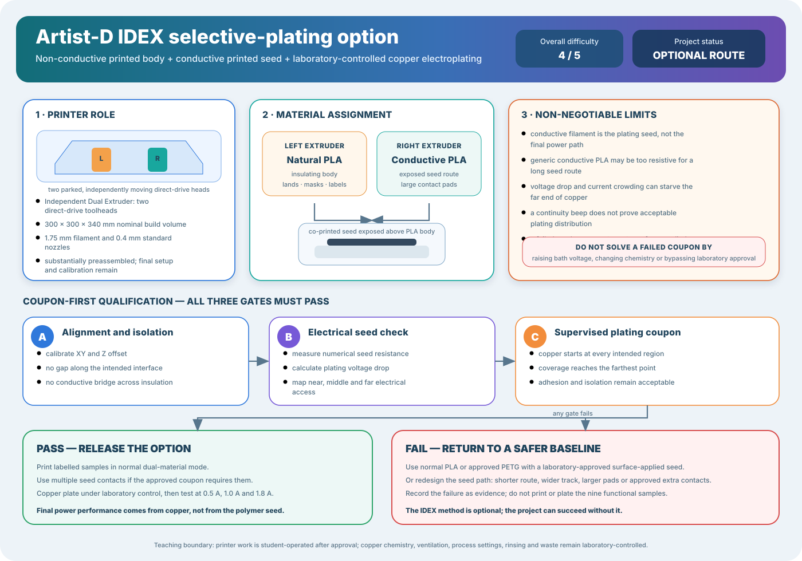

# JG MAKER Artist-D Dual-Material Copper Electroplating Plan

## Large Independent Dual Extrusion Printer Route for Conductive and Non-Conductive Filament

> **Overall project difficulty:** **4/5 — advanced student build** 
> **Optional incremental allowance:** approximately **USD $90–$365** when the printer and supervised plating service already exist 
> **Main rule:** the printed conductive filament is a temporary **seed electrode**; the deposited copper is the final conductor.

## Three-Paragraph Description

The JG MAKER Artist-D is a large material-extrusion printer with two independently moving direct-drive print heads. This arrangement is called **Independent Dual Extrusion**, abbreviated **IDEX**. Its nominal build volume is 300 mm × 300 mm × 340 mm, it uses 1.75 mm filament, and the base and gantry are substantially preassembled at the factory. Retail descriptions may call the machine “98% assembled,” but that phrase should be treated as a convenience claim rather than proof that the printer is level, electrically inspected, calibrated or ready for dual-material engineering work.

For AE3PT, the left extruder prints the non-conductive body and the right extruder prints an exposed conductive seed route. A practical first pairing is ordinary light-coloured Polylactic Acid, abbreviated PLA, with a supplier-documented conductive PLA. The machine can also process materials such as Acrylonitrile Butadiene Styrene, abbreviated ABS, and flexible Thermoplastic Polyurethane, abbreviated TPU, but these should not be the first plated combination. ABS adds shrinkage and enclosure requirements, while flexing TPU beneath a rigid copper coating can cause cracking or delamination.

The hard part is not assembling the printer. The hard part is making two materials meet accurately, preventing conductive contamination, obtaining a low and stable seed resistance, distributing electroplating current to the far end of the route, and depositing copper without bridging or peeling. Generic conductive filament remains dramatically less conductive than copper and can behave more like a printed resistor than a wire. The method is therefore rated difficulty 4/5 and must pass alignment, isolation, resistance, contact and supervised plating coupons before it is used for a functional sample.

## 1. Verified and Advertised Machine Characteristics

| Characteristic | Project interpretation |
|---|---|
| Printer | JG MAKER Artist-D |
| Architecture | Independent Dual Extrusion with two separately moving heads |
| Extrusion | direct-drive filament feed |
| Nominal build volume | 300 mm × 300 mm × 340 mm |
| Filament diameter | 1.75 mm |
| Common nozzle size | 0.4 mm |
| Factory assembly | base and gantry preassembled; final gantry, spool, cable and calibration work remains |
| “98% assembled” description | seller wording; not an engineering acceptance test |
| Suitable practice materials | PLA, PETG, PVA and TPU according to compatible profiles and supplier limits |
| ABS use | possible only with appropriate temperature, ventilation and warp control |
| AE3PT assignment | left tool: insulation; right tool: conductive seed; laboratory process: copper electroplating |

The large build volume is useful for fixtures, replicated coupon arrays and long current paths. It is not a reason to begin with a large plated object. The first release geometry should remain a short coupon that is cheap to discard.

## 2. Difficulty Breakdown

| Activity | Difficulty | Why |
|---|---:|---|
| Complete mechanical assembly | 2/5 | the principal frame units are factory assembled, but cable, gantry and safety inspection remain necessary |
| Single-material PLA printing | 2/5 | conventional setup once the bed, nozzle and extrusion are calibrated |
| Direct-drive TPU printing | 3/5 | direct drive helps flexible filament, but speed, pressure and buckling still require tuning |
| IDEX X, Y and Z calibration | 4/5 | small offset or nozzle-height errors create gaps, scraping or conductive bridges |
| PLA plus conductive-PLA interface | 4/5 | the materials may shrink, ooze, cool and bond differently |
| Conductive-seed verification | 4/5 | resistance varies with geometry, layers, contacts, temperature and filament batch |
| Copper electroplating | 4/5 | current distribution, chemistry, ventilation, adhesion, rinsing and waste require laboratory control |
| Complete Artist-D route | **4/5** | five coupled systems must pass together: printer, materials, seed, contacts and plating |

The 4/5 rating does not mean the project is unsuitable. It means the student should already be comfortable with slicer profiles, printer maintenance, dimensional coupons, electrical measurement and structured debugging.

## 3. Why Conductive Filament Is Difficult

### 3.1 Conductive filament is a composite

Most conductive filament is plastic containing carbon or metal particles. The particles form an imperfect network inside the polymer. The surrounding polymer still resists current and may cover particles at the printed surface. A filament described as conductive may be adequate for touch sensing or static dissipation but unsuitable for distributing electroplating current over a long route.

### 3.2 Resistance increases with length

The approximate seed resistance is:

$$
R_{seed}=\rho_{seed}\frac{L_{seed}}{A_{seed}}
$$

where:

- \(R_{seed}\) is seed resistance in ohms;
- \(\rho_{seed}\) is the effective resistivity of the printed composite;
- \(L_{seed}\) is route length;
- \(A_{seed}=w_{seed}t_{seed}\) is the exposed seed cross-sectional area;
- \(w_{seed}\) is seed width;
- \(t_{seed}\) is seed thickness.

Long, narrow or thin routes have higher resistance. Printed resistivity is not simply the value quoted for raw filament because layer direction, voids, extrusion temperature, flow, particle alignment and contact pressure change the finished path.

### 3.3 High seed resistance produces uneven plating

The estimated voltage lost along the seed is:

$$
\Delta V_{seed}=I_{plate}R_{seed}
$$

If the voltage drop is too large, the region near the electrical contact may plate first while the far end receives little copper. The first copper then lowers resistance locally and can increase current crowding near that contact. This positive feedback may create a thick near-contact deposit and a starved far end.

### 3.4 A continuity beep is insufficient

A multimeter continuity indication only proves that some path exists below the meter’s internal threshold. It does not prove that:

- resistance is low enough for the plating current;
- the route remains stable when flexed or warmed;
- the far end is at a suitable potential;
- separate conductors remain isolated;
- the seed surface can accept copper;
- the final copper will adhere.

Record numerical resistance using fixed probe locations. Where possible, compare two-wire and four-wire measurements and measure near, middle and far sections separately.

### 3.5 Conductive filament names can be misleading

- Copper-coloured decorative filament may contain pigment or particles without forming a conductive network.
- Carbon-filled PLA may be electrically conductive but still too resistive for a long electroplating path.
- Metal-filled filament may be abrasive and can wear a brass nozzle; follow the actual filament supplier’s nozzle guidance.
- A highly conductive specialist filament may require a lower extrusion temperature, slower printing or special storage.
- Data from one brand, batch, printer or orientation cannot release another combination.

## 4. Recommended Material Assignment

### Left extruder: non-conductive body

Start with natural or light-coloured PLA. It makes dark conductive contamination easier to see and avoids the first-stage shrinkage difficulty of ABS.

### Right extruder: conductive seed

Use only a technical conductive filament with:

- published resistance or resistivity information;
- supplier print temperatures and nozzle recommendations;
- a known conductive filler type;
- an available material batch identifier;
- a coupon result on the actual Artist-D.

### Final conductor: electroplated copper

The copper layer must provide the final low-resistance path. The filament remains the mechanical base and distributed plating electrode.

## 5. Geometry Rules

1. Keep the conductive route exposed on the outer surface.
2. Use the shortest practical seed length.
3. Begin with widths of 4 mm and 8 mm rather than a very fine trace.
4. Use at least two printed thicknesses in the coupon matrix.
5. Add large contact pads that can accept copper foil, conductive paste or a laboratory-approved clamp.
6. Add optional intermediate contact pads on long routes.
7. Avoid sharp corners that concentrate current and are difficult to print cleanly.
8. Keep clear insulating gaps around every independent conductor.
9. Add drainage and orientation features so plating liquid cannot be trapped.
10. Do not bury the seed beneath a final insulating skin.

## 6. Printer Preparation Microsteps

1. Download and archive the current Artist-D user guide, firmware identity and slicer profile.
2. Record machine serial number, electrical rating, installed firmware and maintenance history.
3. Complete the remaining gantry, spool-holder and cable assembly described by the manual.
4. Inspect grounding, mains lead, power selector, heaters, fans, thermal protection and cable strain relief.
5. Check the build surface, belts, wheels, Z motion, filament sensors, parking brushes and purge cups.
6. Install clean nozzles that meet both filament suppliers’ requirements.
7. Level the bed and verify single-extruder first layers separately with each head.
8. Calibrate extrusion flow for ordinary PLA.
9. Calibrate extrusion flow for conductive filament using a dedicated material path.
10. Measure the left-to-right X, Y and Z tool offsets.
11. Print an IDEX alignment grid and correct the offsets.
12. Verify the inactive head parks and wipes without dragging material across the part.
13. Label left and right spools, nozzles, purge regions and slicer tools.
14. Print a harmless two-colour interface coupon before using conductive material.
15. Release conductive printing only when the interface and isolation coupon passes.

## 7. Conductive Coupon Matrix

Print at least three independently started copies of each selected geometry.

| Variable | Minimum student matrix |
|---|---|
| seed width | 2 mm, 4 mm and 8 mm |
| seed thickness | at least two printed thicknesses |
| route length | short reference plus the proposed functional length |
| orientation | along layers and across layers where practical |
| contact layout | one end contact and approved distributed-contact option |
| bed position | centre and at least one offset position |

Record dimensions, mass, tool offsets, temperatures, speeds, flow, retraction, wiping, ooze, visible contamination and resistance.

## 8. Pass/Fail Gates

### Gate AD-G0 — Machine release

**PASS** when both heads print independently, all offsets are recorded, the inactive nozzle does not strike the part, and electrical and thermal checks pass.

**FAIL** when either head is unreliable, wiring or heater behaviour is uncertain, or calibration changes between prints.

### Gate AD-G1 — Material isolation

**PASS** when the conductive route is exposed and continuous, insulating gaps remain clear, interfaces survive handling, and no black conductive ooze appears in protected regions.

**FAIL** when the seed is buried, separated, smeared or bridged across insulation.

### Gate AD-G2 — Seed conduction

**PASS** when all three coupons have stable numerical resistance, the far end is electrically reachable, the predicted plating voltage drop is accepted by the laboratory, and contact pads do not damage the print.

**FAIL** when resistance is open, unstable, highly variable, too large for the approved plating current, or concentrated through one fragile contact.

### Gate AD-G3 — Supervised copper coupon

**PASS** when copper initiates along the intended route, reaches the farthest region, remains isolated from neighbouring tracks, adheres after rinsing and meets the post-plating resistance target.

**FAIL** when copper grows mainly near the contact, the far end remains unplated, copper bridges insulation, the seed overheats, the coating blisters or the laboratory stops the run.

### Gate AD-G4 — Functional release

**PASS** only after three independently printed and plated coupons meet the same electrical, dimensional and adhesion criteria.

**FAIL** returns the project to wider and shorter seed geometry, approved additional contacts, a different documented conductive filament or the surface-applied seed baseline. It does not authorise more voltage or an unapproved chemistry change.

## 9. Practical Copper Electroplating Notes

- Chemistry, current limits, ventilation, rinsing, personal protective equipment and waste remain laboratory-controlled.
- Begin at the laboratory-approved low current rather than attempting to force current through a poor seed.
- Use distributed contacts only when the laboratory approves how current will be shared.
- Photograph copper growth at defined intervals so near-contact bias is visible.
- Stop on heating, gas behaviour outside the approved process, blistering, darkening, loss of isolation or unstable voltage.
- After plating, rinse, dry and measure resistance before applying the 0.5 A, 1.0 A and 1.8 A classroom test sequence.

## 10. Cost and Purchase Rule

The detailed option register is [`data/ae3pt-artist-d-option-bom.csv`](data/ae3pt-artist-d-option-bom.csv). The approximate USD $90–$365 allowance assumes that the Artist-D is already owned or borrowed and that supervised copper-plating access is already included in the baseline project.

Do not purchase the machine solely because it has a large build volume, dual extruders or a mostly assembled sales description. Before purchase, confirm electrical compliance, current support files, replacement hot-end availability, both-head calibration, build-surface condition and a return route. A currently supported alternative IDEX printer may be a lower-risk purchase even when its advertised build volume is smaller.

## 11. Minimum Evidence Package

- machine identity, manual and firmware record;
- assembly and electrical inspection checklist;
- left and right single-material calibration results;
- IDEX offset and first-layer evidence;
- material supplier data and batch identifiers;
- coupon geometry and slicer files;
- near, middle and far seed resistance measurements;
- estimated seed voltage drop;
- pre-, during- and post-plating photographs;
- plating process traveller;
- copper adhesion, isolation and final resistance results;
- actual consumable cost, operator time and failed-coupon count.

## 12. Research and Machine References

- [JGMaker official document support and Artist-D files](https://www.jgmaker3d.com/pages/document-download)
- [JG MAKER Artist-D user manual listing and machine specification](https://www.manualslib.com/manual/3075176/Jg-Maker-Artist-D.html)
- [Selective Electroplating for 3D-Printed Electronics](https://doi.org/10.1002/admt.201900126)
- [Direct electroless plating of conductive thermoplastics for selective metallization of 3D printed parts](https://doi.org/10.1016/j.addma.2022.102793)
- [Flash ablation metallization of conductive thermoplastics](https://doi.org/10.1016/j.addma.2020.101409)

## Final Recommendation

Use the Artist-D when it is already available and the project team wants to study multi-material manufacturing as well as electroplating. Start with PLA plus a documented conductive PLA, short wide exposed routes and large pads. Keep ABS and plated TPU as later research variables. Treat every filament specification as provisional until the actual printed coupon proves stable seed resistance and uniform copper coverage.
