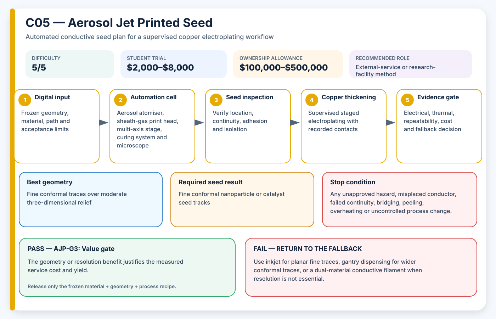

# C05 — Aerosol Jet Printed Seed

**Acronym:** AJP · **Difficulty:** 5/5 — research-grade · **Student trial allowance:** USD $2,000–$8,000 · **Ownership allowance:** USD $100,000–$500,000

[← Conductive Coating Methods](index.md)

## Three-Paragraph Description

Aerosol Jet Printing, abbreviated AJP, atomises a functional ink into very small droplets and focuses the aerosol with a sheath gas before it exits the nozzle. The focused stream can write fine conductive seed traces without touching the surface. In AE3PT it is considered a high-resolution method for placing silver, copper or catalyst inks on non-planar polymer parts before selective electroplating.

AJP can tolerate more surface relief and a larger nozzle-to-part distance than conventional inkjet printing, and multi-axis motion can produce conformal tracks. The complete process still depends on ink atomisation, gas flow, overspray control, nozzle size, tool orientation, drying and sintering. Published work has shown that electroplating copper onto aerosol-jet-printed silver can greatly reduce resistivity and create more robust solderable features, but the platform and metrology are specialised.

For a low-budget student project, AJP should be evaluated through a facility or service using a small test coupon and a clearly defined evidence contract. The student should not treat a quoted trace width as proof that a three-dimensional route will plate successfully. The project must inspect line thickness, porosity, adhesion, electrical continuity, far-end plating and cost per successful part before comparing AJP against much cheaper dispensing or conductive-filament methods.

## Student Planning Card

| Planning field | Project value |
|---|---|
| Method identifier | C05 |
| Expanded name | Aerosol Jet Printed Seed |
| Acronym | AJP |
| Difficulty | 5/5 — research-grade |
| Student trial allowance | USD $2,000–$8,000 |
| Ownership or capital allowance | USD $100,000–$500,000 |
| Best geometry | Fine conformal traces over moderate three-dimensional relief |
| Automation level | Commercial aerodynamic direct-write system |
| Recommended role | External-service or research-facility method |

The allowances are AE3PT planning envelopes in 2026 United States dollars, not supplier quotations. They include representative fixtures, guarding, extraction and qualification work, exclude routine labour and building services, and must be replaced by local written quotations before money is released.

## Operating Principle

**Process principle:** A sheath-gas-focused aerosol writes a fine seed trace that is dried or sintered before copper thickening.

**Automation cell:** Aerosol atomiser, sheath-gas print head, multi-axis stage, curing system and microscope

**Required output:** Fine conformal nanoparticle or catalyst seed tracks

The coating is a **seed layer**: a thin electrically active starting surface. It is not automatically the final current-carrying conductor. The supervised electroplating stage adds the copper thickness required by the electrical and thermal design.

## Required Equipment

- commercial aerosol jet system or qualified facility
- pneumatic or ultrasonic atomiser
- controlled carrier and sheath gas
- multi-axis motion and part registration
- laser or thermal sintering equipment
- microscope and thickness metrology
- plating fixture for fine contacts

## Required Materials

- qualified silver, copper or catalyst ink
- compatible solvents and cleaning materials
- smooth polymer coupons and shaped demonstrator
- gas supplies specified by the process
- electroplating contact and masking materials

## Prerequisites

- service statement covering ink, substrate and geometry limits
- digital trace file and registration features
- approved curing temperature
- minimum line, spacing, resistance and adhesion targets

## Complete Implementation Microsteps

1. Define the minimum feature that has genuine project value.
2. Obtain a facility design-rule review before ordering samples.
3. Create a coupon containing lines, turns, pads, slopes and height transitions.
4. Agree the atomisation, gas, nozzle, motion and curing record to be returned.
5. Print a reference flat coupon and inspect line morphology.
6. Print three shaped coupons using the same qualified recipe.
7. Measure thickness, width, porosity indicators, adhesion and resistance.
8. Design low-resistance plating contacts that do not damage the fine seed.
9. Electroplate a staged time series rather than one uncontrolled long run.
10. Measure resistivity improvement and look for delamination or burning.
11. Compare yield and cost against gantry dispensing and inkjet alternatives.
12. Release AJP only when the required geometry cannot be met more simply.

## Pass/Fail Gates

| Gate | Decision | Pass condition | Fail action |
|---|---|---|---|
| AJP-G0 | Design-rule review | Facility accepts the substrate, three-dimensional path and curing limit. | Redesign or select a different process before purchase. |
| AJP-G1 | Printed morphology | Line width, continuity and adhesion pass on flat and shaped coupons. | Retune atomisation, gases, orientation or curing. |
| AJP-G2 | Electroplating response | Copper thickening reduces resistance without unacceptable delamination or bridging. | Change seed thickness, contact design or plating current. |
| AJP-G3 | Value gate | The geometry or resolution benefit justifies the measured service cost and yield. | Use a lower-cost deposition method. |

A gate is passed only by current evidence from the frozen material, geometry and process recipe. A result from another substrate, previous bath, different machine file or unrecorded operator adjustment cannot release the next stage.

## Safety and Process Controls

| Main risk | Required control |
|---|---|
| Aerosol and solvent exposure | Keep material handling inside the qualified facility and require process records. |
| Hidden overspray | Inspect surrounding insulation and perform isolation tests. |
| Fine-trace burnout during plating | Use staged low-current plating and distributed contacts. |
| Vendor lock-in | Archive neutral geometry, test data and acceptance criteria rather than only machine files. |

Any abnormal heat, smell, gas, smoke, colour change, electrical behaviour, equipment sound or solution condition is a stop signal. Students make no independent substitutions to coatings, catalysts, plating baths, cleaning agents or laser settings.

## Minimum Evidence Package

- facility design-rule response
- neutral Computer-Aided Design and trace files
- atomiser, gas, nozzle and curing record
- microscopy and thickness measurements
- pre- and post-plating electrical results
- three-part yield
- service cost and lead-time comparison

## Cost-Control Plan

1. Buy or book only enough capacity for flat and shaped coupons.
2. Pass the safety and path-control gate before consuming conductive material.
3. Pass the seed gate before using copper bath time.
4. Require three independently prepared results before purchasing upgrades.
5. Compare cost per passing sample, not cost per machine hour or cost per printed part.
6. Preserve a lower-cost fallback in the design so one failed process does not end the project.

## Fallback

Use inkjet for planar fine traces, gantry dispensing for wider conformal traces, or a dual-material conductive filament when resolution is not essential.

## Research Basis

- [Electroplating of Aerosol Jet-Printed Silver Inks](https://doi.org/10.1002/adem.202100362)

These readings establish technical plausibility and important process variables; they do not certify the student apparatus, chemistry, material combination or final part.

## Final Decision Rule

Adopt AJP only when it produces repeatable seed continuity, controlled isolation, acceptable adhesion and successful copper thickening at a cost and safety level justified by geometry that a simpler method cannot meet. Otherwise record the result, preserve the evidence and return to the stated fallback.
