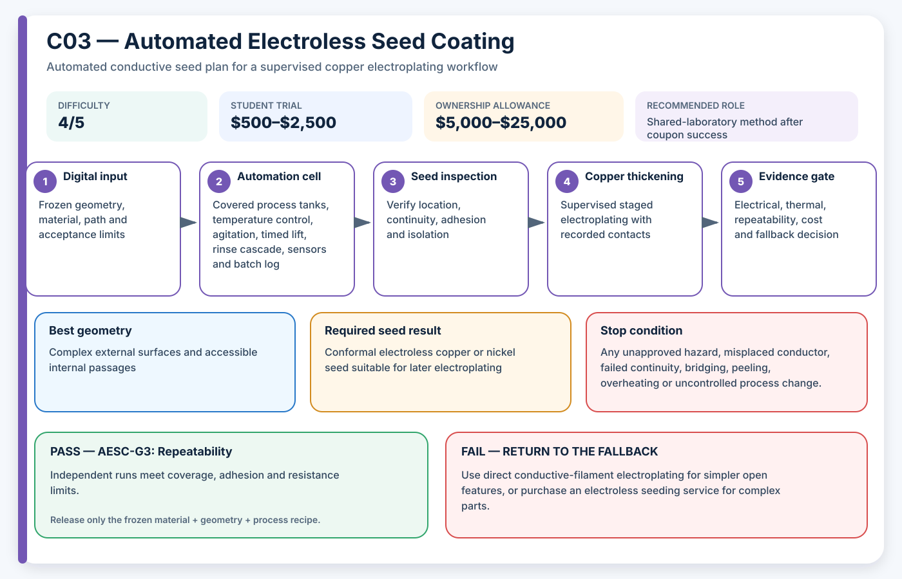

# C03 — Automated Electroless Seed Coating

**Acronym:** AESC · **Difficulty:** 4/5 — advanced · **Student trial allowance:** USD $500–$2,500 · **Ownership allowance:** USD $5,000–$25,000

[← Conductive Coating Methods](index.md)

## Three-Paragraph Description

Automated Electroless Seed Coating, abbreviated AESC, deposits metal through a chemical reduction reaction rather than through current supplied by an external power source. The word electroless distinguishes it from electroplating, where the part is connected as an electrode. Surface preparation and activation allow metal to begin forming on selected regions, creating a continuous seed layer that can be thickened later by conventional copper electroplating.

The process can reach complex external shapes and flowing internal passages that a line-of-sight spray or dispenser cannot reach. Automation normally means controlled bath temperature, agitation, timed immersion, rinsing, solution monitoring and data logging, not unattended chemistry. Selectivity may come from masks, activated surface regions, conductive composite filament, catalyst-loaded material or laser activation, and each route changes the chemical sequence and waste obligations.

For a student project this is an advanced shared-laboratory activity because bath chemistry, ventilation, incompatible chemicals and metal-bearing waste require formal control. The student contribution should focus on fixture design, coupon matrices, timing software, conductivity mapping and evidence capture while trained staff own bath preparation and disposal. Success is defined by uniform, adherent and electrically continuous seed coverage, not simply by a visibly metallic surface.

## Student Planning Card

| Planning field | Project value |
|---|---|
| Method identifier | C03 |
| Expanded name | Automated Electroless Seed Coating |
| Acronym | AESC |
| Difficulty | 4/5 — advanced |
| Student trial allowance | USD $500–$2,500 |
| Ownership or capital allowance | USD $5,000–$25,000 |
| Best geometry | Complex external surfaces and accessible internal passages |
| Automation level | Supervised wet-process line with timed transfers |
| Recommended role | Shared-laboratory method after coupon success |

The allowances are AE3PT planning envelopes in 2026 United States dollars, not supplier quotations. They include representative fixtures, guarding, extraction and qualification work, exclude routine labour and building services, and must be replaced by local written quotations before money is released.

## Operating Principle

**Process principle:** Activated regions catalyse metal reduction from solution until a conductive seed layer covers the intended surface.

**Automation cell:** Covered process tanks, temperature control, agitation, timed lift, rinse cascade, sensors and batch log

**Required output:** Conformal electroless copper or nickel seed suitable for later electroplating

The coating is a **seed layer**: a thin electrically active starting surface. It is not automatically the final current-carrying conductor. The supervised electroplating stage adds the copper thickness required by the electrical and thermal design.

## Required Equipment

- approved wet laboratory with local exhaust ventilation
- covered compatible process and rinse tanks
- temperature, pH and conductivity measurement
- agitation or recirculation system
- programmable timed lift or operator-guided transfer aid
- secondary containment and emergency wash facilities
- solution-analysis and waste-labelling equipment

## Required Materials

- approved cleaning, etching and activation chemistry
- electroless copper or nickel bath
- deionised rinse water
- masked, conductive-composite or catalyst-bearing coupons
- bath-control standards and metal-bearing waste containers

## Prerequisites

- institutional chemical-process approval
- trained laboratory owner for every bath
- material compatibility and coupon plan
- documented solution life and waste route
- defined coverage, adhesion and bath-stability limits

## Complete Implementation Microsteps

1. Select one activation route and prohibit unreviewed chemistry substitutions.
2. Create a process flow diagram showing every bath, rinse and waste stream.
3. Build compatible coupon racks that prevent trapped gas and allow drainage.
4. Commission temperature, pH, timing and agitation logging with harmless water trials.
5. Run activation-only coupons and verify selectivity before metal deposition.
6. Process a three-coupon time series in the electroless bath.
7. Rinse, dry and record mass, resistance and high-resolution images.
8. Section or inspect representative features for coverage and voids.
9. Electroplate only coupons that pass the seed gate.
10. Measure plated thickness, adhesion and isolation between circuits.
11. Repeat with a fresh batch or independently controlled run.
12. Release the method only while bath condition remains inside the approved control window.

## Pass/Fail Gates

| Gate | Decision | Pass condition | Fail action |
|---|---|---|---|
| AESC-G0 | Chemical authority | Named trained staff approve chemistry, ventilation, storage and waste routes. | No wet processing; use an external service or a dry deposition method. |
| AESC-G1 | Bath control | Temperature, pH, timing and solution condition remain inside the frozen window. | Quarantine the run and restore or replace the bath under laboratory authority. |
| AESC-G2 | Seed continuity | Every required zone is conductive and unintended zones remain isolated. | Reject the activation or masking process. |
| AESC-G3 | Repeatability | Independent runs meet coverage, adhesion and resistance limits. | Do not scale to full parts; continue coupon investigation. |

A gate is passed only by current evidence from the frozen material, geometry and process recipe. A result from another substrate, previous bath, different machine file or unrecorded operator adjustment cannot release the next stage.

## Safety and Process Controls

| Main risk | Required control |
|---|---|
| Hazardous or incompatible chemistry | Use an approved written sequence, segregation, secondary containment and trained supervision. |
| Bath decomposition | Log bath loading, temperature and age; stop on abnormal gas, colour, precipitate or deposition. |
| Gas pockets in channels | Orient fixtures for venting, use flow trials and define drain holes. |
| Uncontrolled metal-bearing waste | Collect every process and rinse stream under the laboratory waste plan. |

Any abnormal heat, smell, gas, smoke, colour change, electrical behaviour, equipment sound or solution condition is a stop signal. Students make no independent substitutions to coatings, catalysts, plating baths, cleaning agents or laser settings.

## Minimum Evidence Package

- approved chemical process sheet
- bath and rinse sensor logs
- coupon rack and venting drawing
- seed resistance and coverage map
- mass gain and thickness evidence
- adhesion and isolation test
- batch identity and waste record

## Cost-Control Plan

1. Buy or book only enough capacity for flat and shaped coupons.
2. Pass the safety and path-control gate before consuming conductive material.
3. Pass the seed gate before using copper bath time.
4. Require three independently prepared results before purchasing upgrades.
5. Compare cost per passing sample, not cost per machine hour or cost per printed part.
6. Preserve a lower-cost fallback in the design so one failed process does not end the project.

## Fallback

Use direct conductive-filament electroplating for simpler open features, or purchase an electroless seeding service for complex parts.

## Research Basis

- [Direct electroless plating of conductive thermoplastics](https://doi.org/10.1016/j.addma.2022.102793)
- [Self-activating metal-polymer composites](https://doi.org/10.1016/j.jmrt.2022.12.035)
- [Self-activating resins for 3D printed parts](https://doi.org/10.1016/j.addma.2026.105129)

These readings establish technical plausibility and important process variables; they do not certify the student apparatus, chemistry, material combination or final part.

## Final Decision Rule

Adopt AESC only when it produces repeatable seed continuity, controlled isolation, acceptable adhesion and successful copper thickening at a cost and safety level justified by geometry that a simpler method cannot meet. Otherwise record the result, preserve the evidence and return to the stated fallback.
