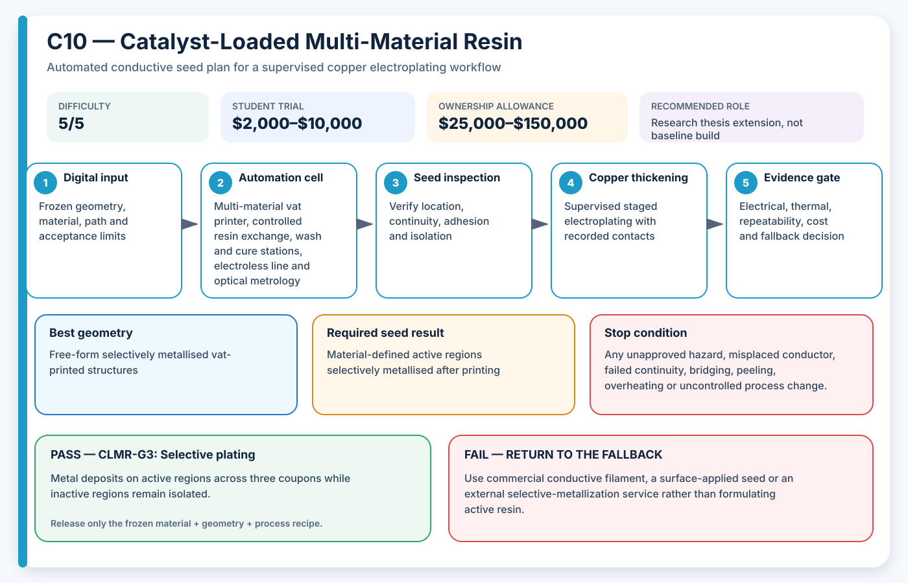

# C10 — Catalyst-Loaded Multi-Material Resin

**Acronym:** CLMR · **Difficulty:** 5/5 — research-grade · **Student trial allowance:** USD $2,000–$10,000 · **Ownership allowance:** USD $25,000–$150,000

[← Conductive Coating Methods](index.md)

## Three-Paragraph Description

Catalyst-Loaded Multi-Material Resin, abbreviated CLMR, embeds a metal-ion or catalytic precursor inside selected regions of a photocurable resin. A multi-material vat-printing process places catalyst-bearing resin where metal is required and ordinary resin elsewhere. After printing and post-curing, the active regions initiate electroless metal deposition, turning material identity itself into the patterning method.

This approach can create free-form three-dimensional metallised paths without a separate spray, dispenser or line-of-sight activation step. Its difficulty comes from resin formulation, particle or salt dispersion, optical absorption, cure depth, interface bonding, vat contamination, material exchange and bath chemistry. The printed geometry, resin chemistry and exposure settings are tightly coupled, so a successful result cannot be transferred casually to another printer or resin.

CLMR is best treated as an advanced research extension after the simpler AE3PT busbar project is complete. A student with polymer, chemistry and vat-printing supervision can study small interface coupons, catalytic concentration, cure behaviour and plating selectivity. The method fails closed if active resin contaminates inactive regions, if cure quality is uncertain, or if the chemical and uncured-resin waste route is not formally approved.

## Student Planning Card

| Planning field | Project value |
|---|---|
| Method identifier | C10 |
| Expanded name | Catalyst-Loaded Multi-Material Resin |
| Acronym | CLMR |
| Difficulty | 5/5 — research-grade |
| Student trial allowance | USD $2,000–$10,000 |
| Ownership or capital allowance | USD $25,000–$150,000 |
| Best geometry | Free-form selectively metallised vat-printed structures |
| Automation level | Multi-material vat printing plus electroless plating |
| Recommended role | Research thesis extension, not baseline build |

The allowances are AE3PT planning envelopes in 2026 United States dollars, not supplier quotations. They include representative fixtures, guarding, extraction and qualification work, exclude routine labour and building services, and must be replaced by local written quotations before money is released.

## Operating Principle

**Process principle:** Catalytic precursor is printed only in selected resin volumes, which later initiate electroless metal deposition.

**Automation cell:** Multi-material vat printer, controlled resin exchange, wash and cure stations, electroless line and optical metrology

**Required output:** Material-defined active regions selectively metallised after printing

The coating is a **seed layer**: a thin electrically active starting surface. It is not automatically the final current-carrying conductor. The supervised electroplating stage adds the copper thickness required by the electrical and thermal design.

## Required Equipment

- multi-material Digital Light Processing or stereolithography printer
- controlled resin mixing and degassing equipment
- separate labelled vats or automated material exchange
- exposure calibration and cure-depth measurement
- closed washing and post-curing stations
- approved electroless plating line
- microscopy, resistance and adhesion test equipment

## Required Materials

- base photocurable resin
- approved metal salt, catalyst or active filler
- inactive reference resin
- dedicated wash materials and filters
- electroless metal bath and controlled waste containers

## Prerequisites

- chemical and uncured-resin approval
- material formulation plan with concentration limits
- printer contamination and cleaning procedure
- defined cure, interface, selectivity and plating criteria

## Complete Implementation Microsteps

1. Choose one published catalyst family and one compatible base resin.
2. Prepare a written formulation, labelling, mixing and waste procedure.
3. Measure optical cure depth across a conservative concentration series.
4. Print single-material active and inactive reference coupons.
5. Wash and cure each coupon using a controlled, recorded sequence.
6. Electroless plate reference coupons to confirm activity and background deposition.
7. Print two-material interface coupons with wide alignment features.
8. Inspect interface bonding, cure inhibition and cross-contamination.
9. Plate three passing interface coupons and map selectivity.
10. Measure resistance, adhesion, dimensional change and uncured residue.
11. Attempt one simple three-dimensional route only after all coupon gates pass.
12. Archive formulation, exposure, cleaning and bath evidence as one inseparable recipe.

## Pass/Fail Gates

| Gate | Decision | Pass condition | Fail action |
|---|---|---|---|
| CLMR-G0 | Chemical and resin authority | Named staff approve catalyst, resin, washing, exposure and waste routes. | Do not formulate or print active resin. |
| CLMR-G1 | Printability | Active and inactive coupons meet cure depth, dimensions and mechanical handling limits. | Change concentration, exposure or resin system. |
| CLMR-G2 | Material isolation | Two-material interfaces remain bonded and background catalyst transfer stays below the limit. | Stop multi-material work and improve vat exchange or masking. |
| CLMR-G3 | Selective plating | Metal deposits on active regions across three coupons while inactive regions remain isolated. | Reject the formulation or cleaning process. |

A gate is passed only by current evidence from the frozen material, geometry and process recipe. A result from another substrate, previous bath, different machine file or unrecorded operator adjustment cannot release the next stage.

## Safety and Process Controls

| Main risk | Required control |
|---|---|
| Uncured resin exposure | Use closed handling, gloves selected by risk assessment and dedicated wash controls. |
| Catalyst or metal-salt toxicity | Use the minimum quantity in a supervised laboratory and collect all contaminated waste. |
| Cross-contamination | Use separate vats, blank wash checks and contamination witness coupons. |
| Incomplete cure | Measure cure depth, use conservative exposure and reject tacky or uncertain parts. |

Any abnormal heat, smell, gas, smoke, colour change, electrical behaviour, equipment sound or solution condition is a stop signal. Students make no independent substitutions to coatings, catalysts, plating baths, cleaning agents or laser settings.

## Minimum Evidence Package

- approved formulation and batch sheet
- cure-depth and dimensional calibration
- printer cleaning and contamination checks
- interface microscopy
- active versus inactive plating map
- resistance, adhesion and mechanical handling results
- resin, wash and metal-waste record

## Cost-Control Plan

1. Buy or book only enough capacity for flat and shaped coupons.
2. Pass the safety and path-control gate before consuming conductive material.
3. Pass the seed gate before using copper bath time.
4. Require three independently prepared results before purchasing upgrades.
5. Compare cost per passing sample, not cost per machine hour or cost per printed part.
6. Preserve a lower-cost fallback in the design so one failed process does not end the project.

## Fallback

Use commercial conductive filament, a surface-applied seed or an external selective-metallization service rather than formulating active resin.

## Research Basis

- [Self-activating metal-polymer composites](https://doi.org/10.1016/j.jmrt.2022.12.035)
- [Self-activating resins for 3D printed parts](https://doi.org/10.1016/j.addma.2026.105129)

These readings establish technical plausibility and important process variables; they do not certify the student apparatus, chemistry, material combination or final part.

## Final Decision Rule

Adopt CLMR only when it produces repeatable seed continuity, controlled isolation, acceptable adhesion and successful copper thickening at a cost and safety level justified by geometry that a simpler method cannot meet. Otherwise record the result, preserve the evidence and return to the stated fallback.
