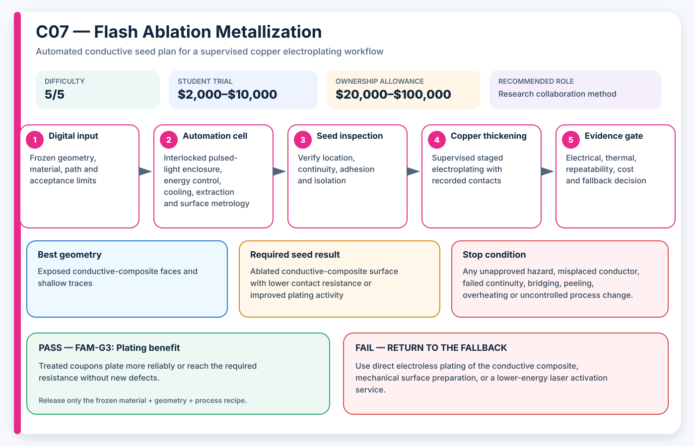

# C07 — Flash Ablation Metallization

**Acronym:** FAM · **Difficulty:** 5/5 — research-grade · **Student trial allowance:** USD $2,000–$10,000 · **Ownership allowance:** USD $20,000–$100,000

[← Conductive Coating Methods](index.md)

## Three-Paragraph Description

Flash Ablation Metallization, abbreviated FAM, exposes a conductive composite polymer to a short pulse of high-intensity broad-spectrum light. The pulse removes or modifies part of the polymer-rich surface and leaves a denser network of conductive filler near the surface. The name combines flash exposure, surface ablation and metallization because the treatment converts a poorly conductive composite surface into a more useful electrical contact or plating seed.

Published experiments report rapid, non-contact conductivity improvement and show that the method can support later electroless copper deposition on appropriate conductive thermoplastics. The process may be compatible with inline manufacturing, but it is strongly dependent on filler type, film thickness, pulse energy, distance, cooling and the optical response of the polymer. Shadowed or internal surfaces are not treated unless the light can reach them.

This is not a recommended student-built flash lamp because stored electrical energy, intense light, ultraviolet exposure, hot debris and fumes create substantial hazards. A student project should use a qualified research facility and focus on coupon design, energy-response analysis, surface microscopy, resistance mapping and plating verification. The method passes only when conductivity improves without unacceptable warping, burning, cracking, loss of adhesion or damage to neighbouring insulation.

## Student Planning Card

| Planning field | Project value |
|---|---|
| Method identifier | C07 |
| Expanded name | Flash Ablation Metallization |
| Acronym | FAM |
| Difficulty | 5/5 — research-grade |
| Student trial allowance | USD $2,000–$10,000 |
| Ownership or capital allowance | USD $20,000–$100,000 |
| Best geometry | Exposed conductive-composite faces and shallow traces |
| Automation level | Enclosed high-intensity pulsed-light processing |
| Recommended role | Research collaboration method |

The allowances are AE3PT planning envelopes in 2026 United States dollars, not supplier quotations. They include representative fixtures, guarding, extraction and qualification work, exclude routine labour and building services, and must be replaced by local written quotations before money is released.

## Operating Principle

**Process principle:** A high-energy light pulse removes polymer-rich surface material and exposes a metal- or carbon-dense conductive network.

**Automation cell:** Interlocked pulsed-light enclosure, energy control, cooling, extraction and surface metrology

**Required output:** Ablated conductive-composite surface with lower contact resistance or improved plating activity

The coating is a **seed layer**: a thin electrically active starting surface. It is not automatically the final current-carrying conductor. The supervised electroplating stage adds the copper thickness required by the electrical and thermal design.

## Required Equipment

- qualified photonic-curing or flash-lamp facility
- interlocked opaque enclosure and energy monitor
- controlled part distance and cooling fixture
- local exhaust and debris containment
- surface profilometer or microscopy
- four-wire resistance mapping
- electroless or electrolytic plating capability

## Required Materials

- conductive composite filament with documented filler
- thickness and colour reference coupons
- heat witness labels or embedded temperature sensors
- cleaning and plating materials
- approved debris and waste containers

## Prerequisites

- facility photonic-process approval
- material-specific optical and thermal review
- coupon energy matrix
- defined conductance gain and damage limits

## Complete Implementation Microsteps

1. Print a controlled thickness series in the selected conductive composite.
2. Measure baseline resistance, thickness, mass and surface appearance.
3. Agree pulse-energy, distance, count and cooling limits with the facility.
4. Expose sacrificial coupons across a conservative energy matrix.
5. Inspect immediately for smoke, warping, blistering, cracking and debris.
6. Measure conductance change and map surface uniformity.
7. Use microscopy or profiling to relate conductivity to surface modification.
8. Electroless plate or electroplate only undamaged passing coupons.
9. Measure plating initiation, coverage, adhesion and final resistance.
10. Repeat the selected exposure on three independent printed coupons.
11. Test a shaped coupon with known shadowed regions.
12. Document geometry exclusions and decide whether the gain justifies facility dependence.

## Pass/Fail Gates

| Gate | Decision | Pass condition | Fail action |
|---|---|---|---|
| FAM-G0 | Facility safety | Interlocks, optical containment, extraction and stored-energy controls are approved. | Do not construct or operate a student flash source. |
| FAM-G1 | Damage limit | No passing coupon exceeds the warp, crack, burn or insulation-damage limit. | Reduce energy or reject the material. |
| FAM-G2 | Conductance response | Three coupons achieve the minimum conductance gain with acceptable variation. | Change composite, thickness or exposure recipe. |
| FAM-G3 | Plating benefit | Treated coupons plate more reliably or reach the required resistance without new defects. | Use untreated conductive filament or another seed process. |

A gate is passed only by current evidence from the frozen material, geometry and process recipe. A result from another substrate, previous bath, different machine file or unrecorded operator adjustment cannot release the next stage.

## Safety and Process Controls

| Main risk | Required control |
|---|---|
| Intense optical radiation | Use an interlocked opaque facility enclosure; no direct observation. |
| Stored electrical energy | Facility operators own discharge, lockout and maintenance. |
| Fumes and ejected debris | Use extraction and closed debris capture. |
| Subsurface damage | Inspect sectioned coupons and enforce conservative energy limits. |

Any abnormal heat, smell, gas, smoke, colour change, electrical behaviour, equipment sound or solution condition is a stop signal. Students make no independent substitutions to coatings, catalysts, plating baths, cleaning agents or laser settings.

## Minimum Evidence Package

- facility and interlock approval
- material batch and print thickness record
- pulse energy, count, distance and cooling log
- before-and-after surface images
- conductance improvement distribution
- plating initiation and adhesion result
- explicit shadow and geometry limits

## Cost-Control Plan

1. Buy or book only enough capacity for flat and shaped coupons.
2. Pass the safety and path-control gate before consuming conductive material.
3. Pass the seed gate before using copper bath time.
4. Require three independently prepared results before purchasing upgrades.
5. Compare cost per passing sample, not cost per machine hour or cost per printed part.
6. Preserve a lower-cost fallback in the design so one failed process does not end the project.

## Fallback

Use direct electroless plating of the conductive composite, mechanical surface preparation, or a lower-energy laser activation service.

## Research Basis

- [Flash ablation metallization of conductive thermoplastics](https://doi.org/10.1016/j.addma.2020.101409)
- [Direct electroless plating of conductive thermoplastics](https://doi.org/10.1016/j.addma.2022.102793)

These readings establish technical plausibility and important process variables; they do not certify the student apparatus, chemistry, material combination or final part.

## Final Decision Rule

Adopt FAM only when it produces repeatable seed continuity, controlled isolation, acceptable adhesion and successful copper thickening at a cost and safety level justified by geometry that a simpler method cannot meet. Otherwise record the result, preserve the evidence and return to the stated fallback.
