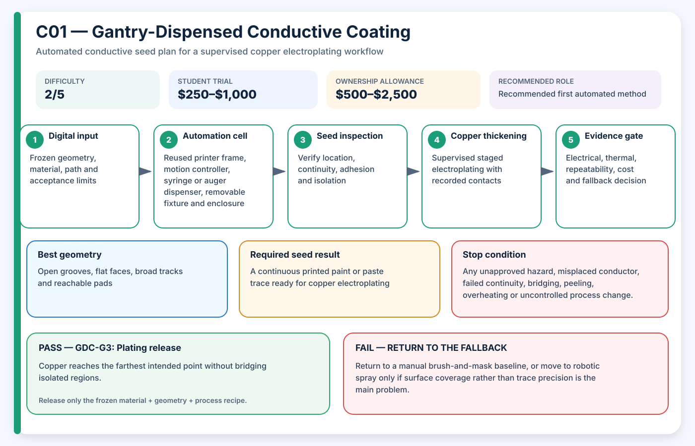

# C01 — Gantry-Dispensed Conductive Coating

**Acronym:** GDC · **Difficulty:** 2/5 — moderate · **Student trial allowance:** USD $250–$1,000 · **Ownership allowance:** USD $500–$2,500

[← Conductive Coating Methods](index.md)

## Three-Paragraph Description

Gantry-dispensed conductive coating uses a computer-controlled syringe, auger or positive-displacement dispenser to place conductive paint, paste or ink onto selected regions of a printed polymer part. The name comes from the bridge-like gantry that moves the tool in the horizontal X and Y directions while the build platform or tool provides a limited vertical Z adjustment. In AE3PT this is the simplest way to turn a digital conductor path into a repeatable seed layer without asking a student to paint every trace by hand.

The method is most suitable for open surfaces, printed grooves and large connection pads. It can reuse an old three-dimensional printer, computer numerical control frame or purpose-built belt gantry, but the original extrusion hot end is replaced or supplemented by a low-pressure liquid dispenser. The deposited seed does not have to carry the final operating current; it only needs continuous conductivity, acceptable adhesion and enough chemical compatibility to begin supervised copper electroplating.

For a third-year student project, the main learning value is the connection between path planning, fluid behaviour, electrical continuity and process evidence. The student can write the path generator, tune speed and flow, inspect line width, measure resistance and create an automatic pass/fail report. The approach is inexpensive and repairable, although it cannot easily coat hidden channels, severe undercuts or the back of a complex part without additional axes or repositioning fixtures.

## Student Planning Card

| Planning field | Project value |
|---|---|
| Method identifier | C01 |
| Expanded name | Gantry-Dispensed Conductive Coating |
| Acronym | GDC |
| Difficulty | 2/5 — moderate |
| Student trial allowance | USD $250–$1,000 |
| Ownership or capital allowance | USD $500–$2,500 |
| Best geometry | Open grooves, flat faces, broad tracks and reachable pads |
| Automation level | Student-built two-and-a-half-axis motion |
| Recommended role | Recommended first automated method |

The allowances are AE3PT planning envelopes in 2026 United States dollars, not supplier quotations. They include representative fixtures, guarding, extraction and qualification work, exclude routine labour and building services, and must be replaced by local written quotations before money is released.

## Operating Principle

**Process principle:** A controlled nozzle meters a conductive liquid along a toolpath exported from Computer-Aided Design data.

**Automation cell:** Reused printer frame, motion controller, syringe or auger dispenser, removable fixture and enclosure

**Required output:** A continuous printed paint or paste trace ready for copper electroplating

The coating is a **seed layer**: a thin electrically active starting surface. It is not automatically the final current-carrying conductor. The supervised electroplating stage adds the copper thickness required by the electrical and thermal design.

## Required Equipment

- reused Cartesian printer or small computer numerical control gantry
- stepper controller with emergency stop
- syringe pump, auger valve or time-pressure dispenser
- disposable needles or tapered nozzles
- camera, lighting and dimensional scale
- four-wire resistance measurement fixture
- local exhaust or enclosed drying area required by the chosen coating

## Required Materials

- water-based conductive paint or laboratory-approved conductive paste
- printed polymer coupons and final parts
- removable masking film and cleaning materials
- copper-plating contact tabs
- waste containers specified by the laboratory

## Prerequisites

- approved low-voltage machine modification plan
- Safety Data Sheet review for the coating
- one flat coupon and one curved coupon geometry
- defined minimum seed resistance and adhesion target

## Complete Implementation Microsteps

1. Freeze one seed-track geometry, datum system and contact-pad design.
2. Measure coating viscosity, drying behaviour and compatibility on scrap polymer.
3. Build the dispenser mount without disabling printer guarding or emergency stop functions.
4. Calibrate deposited mass per command using repeated straight-line coupons.
5. Write a path exporter that limits speed, acceleration, overlap and nozzle clearance.
6. Print three dry-run paths with a harmless test fluid and inspect registration.
7. Deposit three conductive seed coupons using the frozen recipe.
8. Dry or cure under the coating supplier and laboratory limits.
9. Measure line width, continuity, adhesion and end-to-end resistance.
10. Electroplate one approved coupon and map copper coverage from contact to far end.
11. Repeat the complete cycle on three independent parts.
12. Release the method only when the generator, machine file and evidence package reproduce the result.

## Pass/Fail Gates

| Gate | Decision | Pass condition | Fail action |
|---|---|---|---|
| GDC-G0 | Machine safety | Emergency stop, guarded motion and spill containment pass inspection. | Stop modification and use manual coating or an approved service. |
| GDC-G1 | Path accuracy | Ninety-five percent of measured track width and position values meet the frozen tolerance. | Adjust fixture, nozzle height, speed or flow; do not use conductive material yet. |
| GDC-G2 | Seed quality | All three coupons pass continuity, adhesion and maximum seed resistance. | Reject the recipe and change surface preparation or coating. |
| GDC-G3 | Plating release | Copper reaches the farthest intended point without bridging isolated regions. | Redesign contacts or shorten the current path before another supervised plating trial. |

A gate is passed only by current evidence from the frozen material, geometry and process recipe. A result from another substrate, previous bath, different machine file or unrecorded operator adjustment cannot release the next stage.

## Safety and Process Controls

| Main risk | Required control |
|---|---|
| Solvent or aerosol exposure | Prefer water-based material; otherwise use laboratory-approved extraction and personal protective equipment. |
| Nozzle pressure or sudden release | Use rated tubing, low pressure, a shield and depressurise before maintenance. |
| Interrupted seed trace | Use camera inspection plus four-wire resistance measurement before plating. |
| Copper bridging | Increase spacing, improve masking and stop at the first unintended deposit. |

Any abnormal heat, smell, gas, smoke, colour change, electrical behaviour, equipment sound or solution condition is a stop signal. Students make no independent substitutions to coatings, catalysts, plating baths, cleaning agents or laser settings.

## Minimum Evidence Package

- frozen Computer-Aided Design and toolpath files
- dispenser calibration curve
- before-and-after images with scale
- seed resistance and adhesion results
- plated thickness or mass-gain estimate
- three-run repeatability table
- cost and operator-time record

## Cost-Control Plan

1. Buy or book only enough capacity for flat and shaped coupons.
2. Pass the safety and path-control gate before consuming conductive material.
3. Pass the seed gate before using copper bath time.
4. Require three independently prepared results before purchasing upgrades.
5. Compare cost per passing sample, not cost per machine hour or cost per printed part.
6. Preserve a lower-cost fallback in the design so one failed process does not end the project.

## Fallback

Return to a manual brush-and-mask baseline, or move to robotic spray only if surface coverage rather than trace precision is the main problem.

## Research Basis

- [Rapid 3D-Plastronics selective metallization](https://doi.org/10.1016/j.addma.2023.103673)
- [Selective electroplating of dual-material printed parts](https://doi.org/10.1016/j.addma.2018.01.006)

These readings establish technical plausibility and important process variables; they do not certify the student apparatus, chemistry, material combination or final part.

## Final Decision Rule

Adopt GDC only when it produces repeatable seed continuity, controlled isolation, acceptable adhesion and successful copper thickening at a cost and safety level justified by geometry that a simpler method cannot meet. Otherwise record the result, preserve the evidence and return to the stated fallback.
