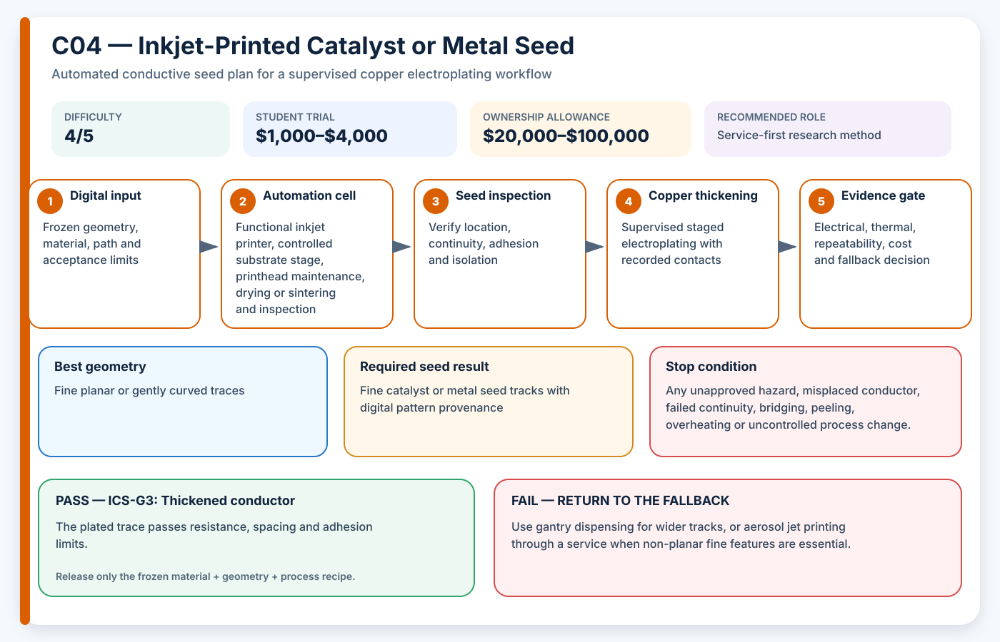

# C04 — Inkjet-Printed Catalyst or Metal Seed

**Acronym:** ICS · **Difficulty:** 4/5 — advanced · **Student trial allowance:** USD $1,000–$4,000 · **Ownership allowance:** USD $20,000–$100,000

[← Conductive Coating Methods](index.md)

## Three-Paragraph Description

Inkjet-Printed Catalyst or Metal Seed, shortened to ICS, uses digitally controlled droplets to place either a plating catalyst or a thin conductive metal pattern. Unlike office inkjet printing, functional inkjet systems control droplet formation, substrate temperature, waveform, nozzle condition and material compatibility. The printed image becomes the chemical or electrical starting pattern for later electroless deposition or copper electroplating.

The method can create finer tracks than a syringe dispenser and wastes little material because droplets are placed only where required. It performs best on planar or gently curved surfaces with controlled surface energy and limited height variation. Reactive copper inks, nanoparticle inks and catalyst-bearing inks each require different drying, sintering or activation conditions, so the printer, ink, substrate and post-process must be qualified as one system.

A student team should normally begin through a university facility or commercial service rather than purchase a functional inkjet platform. The valuable student work is designing test patterns, controlling files, measuring drop placement, evaluating line breaks and comparing electroless or electrolytic thickening. The main failure modes are nozzle blockage, poor wetting, coffee-ring deposits, thermal damage, oxidation and weak adhesion, all of which must be detected on coupons before a three-dimensional part is attempted.

## Student Planning Card

| Planning field | Project value |
|---|---|
| Method identifier | C04 |
| Expanded name | Inkjet-Printed Catalyst or Metal Seed |
| Acronym | ICS |
| Difficulty | 4/5 — advanced |
| Student trial allowance | USD $1,000–$4,000 |
| Ownership or capital allowance | USD $20,000–$100,000 |
| Best geometry | Fine planar or gently curved traces |
| Automation level | Drop-on-demand digital patterning |
| Recommended role | Service-first research method |

The allowances are AE3PT planning envelopes in 2026 United States dollars, not supplier quotations. They include representative fixtures, guarding, extraction and qualification work, exclude routine labour and building services, and must be replaced by local written quotations before money is released.

## Operating Principle

**Process principle:** Drop-on-demand droplets define a catalyst or metal pattern that is activated, sintered or plated into a continuous conductor.

**Automation cell:** Functional inkjet printer, controlled substrate stage, printhead maintenance, drying or sintering and inspection

**Required output:** Fine catalyst or metal seed tracks with digital pattern provenance

The coating is a **seed layer**: a thin electrically active starting surface. It is not automatically the final current-carrying conductor. The supervised electroplating stage adds the copper thickness required by the electrical and thermal design.

## Required Equipment

- functional materials inkjet printer or qualified service
- temperature-controlled vacuum platen
- printhead waveform and cleaning station
- drop-watcher or microscope
- controlled drying, photonic curing or low-temperature sintering
- surface-energy measurement or wetting test
- four-wire microtrace resistance fixture

## Required Materials

- compatible catalyst, reactive metal or nanoparticle ink
- filtered cleaning and flushing fluid
- smooth printed polymer coupons
- surface-treatment materials approved for the substrate
- electroless or electrolytic thickening chemistry

## Prerequisites

- facility-approved ink and printhead combination
- substrate temperature and dimensional stability data
- test pattern with line, pad, corner and spacing features
- defined droplet, line-width, continuity and adhesion limits

## Complete Implementation Microsteps

1. Choose whether the ink provides catalyst, conductive metal or both.
2. Design a calibration pattern covering line width, spacing, pads and turns.
3. Measure substrate flatness, surface energy and allowable heating.
4. Tune waveform, drop spacing, stage speed and substrate temperature on facility coupons.
5. Print microscope slides or reference substrates to confirm droplet quality.
6. Print three polymer coupons with the frozen digital file.
7. Dry, sinter or activate using the lowest successful thermal budget.
8. Inspect for missing drops, spreading, satellites, cracks and oxidation.
9. Measure resistance or verify catalytic activity before thickening.
10. Electroless plate or electroplate the approved patterns.
11. Test line resistance, adhesion, minimum spacing and solder-pad suitability.
12. Archive printhead, ink batch, waveform and file identity with the result.

## Pass/Fail Gates

| Gate | Decision | Pass condition | Fail action |
|---|---|---|---|
| ICS-G0 | Facility compatibility | Ink, printhead, substrate and post-process are approved as one system. | Use an external service or a dispenser-based process. |
| ICS-G1 | Drop quality | Drop position, diameter and satellite count meet the frozen inspection limits. | Clean or retune the printhead before using polymer coupons. |
| ICS-G2 | Printed seed | Three coupons meet line continuity or catalytic-activity requirements. | Change surface treatment, drop spacing or curing. |
| ICS-G3 | Thickened conductor | The plated trace passes resistance, spacing and adhesion limits. | Do not transfer the pattern to a functional part. |

A gate is passed only by current evidence from the frozen material, geometry and process recipe. A result from another substrate, previous bath, different machine file or unrecorded operator adjustment cannot release the next stage.

## Safety and Process Controls

| Main risk | Required control |
|---|---|
| Nanoparticle or reactive-ink exposure | Use facility controls, closed cartridges and approved cleaning procedures. |
| Nozzle clogging | Filter compatible inks, log idle time and use controlled purge routines. |
| Excessive substrate heat | Use temperature labels or sensors and define a strict thermal ceiling. |
| Oxidised or discontinuous copper | Control atmosphere or chemistry as required and verify continuity before plating. |

Any abnormal heat, smell, gas, smoke, colour change, electrical behaviour, equipment sound or solution condition is a stop signal. Students make no independent substitutions to coatings, catalysts, plating baths, cleaning agents or laser settings.

## Minimum Evidence Package

- test-pattern source file and checksum
- ink batch, waveform and printhead record
- drop and line microscopy
- surface preparation and thermal log
- pre- and post-plating resistance
- minimum-spacing and adhesion result
- service quotation or equipment cost model

## Cost-Control Plan

1. Buy or book only enough capacity for flat and shaped coupons.
2. Pass the safety and path-control gate before consuming conductive material.
3. Pass the seed gate before using copper bath time.
4. Require three independently prepared results before purchasing upgrades.
5. Compare cost per passing sample, not cost per machine hour or cost per printed part.
6. Preserve a lower-cost fallback in the design so one failed process does not end the project.

## Fallback

Use gantry dispensing for wider tracks, or aerosol jet printing through a service when non-planar fine features are essential.

## Research Basis

- [Reactive inkjet copper patterns and electroless plating](https://doi.org/10.1016/j.apsusc.2016.09.152)
- [Inkjet copper-complex patterns on three-dimensional polymers](https://doi.org/10.1002/admi.201701285)

These readings establish technical plausibility and important process variables; they do not certify the student apparatus, chemistry, material combination or final part.

## Final Decision Rule

Adopt ICS only when it produces repeatable seed continuity, controlled isolation, acceptable adhesion and successful copper thickening at a cost and safety level justified by geometry that a simpler method cannot meet. Otherwise record the result, preserve the evidence and return to the stated fallback.
