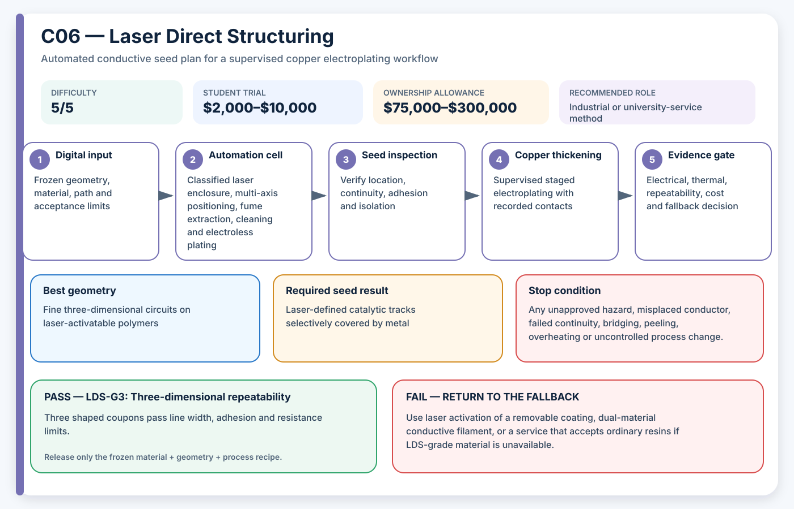

# C06 — Laser Direct Structuring

**Acronym:** LDS · **Difficulty:** 5/5 — research-grade · **Student trial allowance:** USD $2,000–$10,000 · **Ownership allowance:** USD $75,000–$300,000

[← Conductive Coating Methods](index.md)

## Three-Paragraph Description

Laser Direct Structuring, abbreviated LDS, uses a focused laser to expose or activate catalyst sites in a compatible polymer surface. The activated path then initiates selective electroless metal deposition. The term originated in three-dimensional moulded interconnect device manufacturing, where electrical circuits are formed directly on shaped plastic rather than assembled as a separate flat printed circuit board.

LDS offers precise digital routing, good three-dimensional integration and strong industrial relevance, but it is a system process rather than a single machine purchase. The polymer must contain or receive a suitable activator, laser wavelength and energy must create active sites without excessive damage, and the subsequent cleaning and electroless baths must preserve selectivity. Multi-axis access, focus, fumes and laser classification become important on complex printed parts.

A student project should normally use an accredited laser and plating facility. The student can design activation coupons, simulate line-of-sight access, prepare safe process files and analyse microscopy, resistance and adhesion results. A pass requires both accurate laser patterning and selective metal growth; a visually darkened line that does not plate, or a plated line surrounded by unintended copper, is a failed process.

## Student Planning Card

| Planning field | Project value |
|---|---|
| Method identifier | C06 |
| Expanded name | Laser Direct Structuring |
| Acronym | LDS |
| Difficulty | 5/5 — research-grade |
| Student trial allowance | USD $2,000–$10,000 |
| Ownership or capital allowance | USD $75,000–$300,000 |
| Best geometry | Fine three-dimensional circuits on laser-activatable polymers |
| Automation level | Enclosed laser activation and electroless line |
| Recommended role | Industrial or university-service method |

The allowances are AE3PT planning envelopes in 2026 United States dollars, not supplier quotations. They include representative fixtures, guarding, extraction and qualification work, exclude routine labour and building services, and must be replaced by local written quotations before money is released.

## Operating Principle

**Process principle:** A laser exposes catalytic sites in an activatable polymer, followed by selective electroless metal growth.

**Automation cell:** Classified laser enclosure, multi-axis positioning, fume extraction, cleaning and electroless plating

**Required output:** Laser-defined catalytic tracks selectively covered by metal

The coating is a **seed layer**: a thin electrically active starting surface. It is not automatically the final current-carrying conductor. The supervised electroplating stage adds the copper thickness required by the electrical and thermal design.

## Required Equipment

- laser direct structuring system or accredited laser facility
- wavelength-compatible optics and focus control
- multi-axis fixture and registration
- fume extraction and laser safety interlocks
- cleaning and electroless plating line
- microscopy and surface-profile measurement
- electrical and adhesion test equipment

## Required Materials

- laser-activatable thermoplastic or approved activator coating
- reference activation coupons
- cleaning and electroless chemistry
- masking and handling fixtures
- metal-bearing waste containers

## Prerequisites

- laser safety officer approval
- material supplier activation data
- facility design rules and file format
- defined line width, heat damage, selectivity and adhesion limits

## Complete Implementation Microsteps

1. Select an activatable polymer and obtain its processing window.
2. Design a coupon with energy, speed, hatch and focus test zones.
3. Simulate laser access and fixture rotations for the shaped part.
4. Review the process under the facility laser-safety procedure.
5. Activate reference coupons across the approved parameter matrix.
6. Inspect track width, roughness, debris and thermal damage.
7. Clean and electroless plate the parameter matrix.
8. Measure selectivity, continuity, adhesion and minimum spacing.
9. Run the best setting on three shaped coupons.
10. Map focus and width changes around three-dimensional transitions.
11. Compare service yield and route freedom against simpler methods.
12. Release only the material, geometry and laser recipe that passed together.

## Pass/Fail Gates

| Gate | Decision | Pass condition | Fail action |
|---|---|---|---|
| LDS-G0 | Laser and material release | Facility approves material, wavelength, enclosure, extraction and file. | Do not expose the material; use a non-laser seed route. |
| LDS-G1 | Activation window | A repeatable parameter window produces active tracks without unacceptable polymer damage. | Revise energy, speed, focus or material. |
| LDS-G2 | Selective metallization | Metal grows on intended tracks while isolation zones remain below the leakage limit. | Reject cleaning, activation or bath settings. |
| LDS-G3 | Three-dimensional repeatability | Three shaped coupons pass line width, adhesion and resistance limits. | Keep LDS at flat-coupon research stage. |

A gate is passed only by current evidence from the frozen material, geometry and process recipe. A result from another substrate, previous bath, different machine file or unrecorded operator adjustment cannot release the next stage.

## Safety and Process Controls

| Main risk | Required control |
|---|---|
| Laser exposure and fumes | Use only an interlocked classified enclosure with trained facility operators and extraction. |
| Polymer heat damage | Inspect profile and microscopy; enforce energy and temperature limits. |
| Focus loss on curves | Use calibrated multi-axis motion and focus compensation. |
| Non-selective plating | Use isolation coupons and stop the bath at the first background deposit. |

Any abnormal heat, smell, gas, smoke, colour change, electrical behaviour, equipment sound or solution condition is a stop signal. Students make no independent substitutions to coatings, catalysts, plating baths, cleaning agents or laser settings.

## Minimum Evidence Package

- material and laser approval records
- parameter matrix and source file
- activation microscopy and surface profile
- electroless bath log
- selectivity, resistance and adhesion results
- three-dimensional registration map
- service cost and yield assessment

## Cost-Control Plan

1. Buy or book only enough capacity for flat and shaped coupons.
2. Pass the safety and path-control gate before consuming conductive material.
3. Pass the seed gate before using copper bath time.
4. Require three independently prepared results before purchasing upgrades.
5. Compare cost per passing sample, not cost per machine hour or cost per printed part.
6. Preserve a lower-cost fallback in the design so one failed process does not end the project.

## Fallback

Use laser activation of a removable coating, dual-material conductive filament, or a service that accepts ordinary resins if LDS-grade material is unavailable.

## Research Basis

- [Selective metallization on copper aluminate composite by LDS](https://doi.org/10.1016/j.compositesb.2016.11.041)
- [Hybrid vat printing and laser-activated metallization](https://doi.org/10.1016/j.addma.2023.103388)

These readings establish technical plausibility and important process variables; they do not certify the student apparatus, chemistry, material combination or final part.

## Final Decision Rule

Adopt LDS only when it produces repeatable seed continuity, controlled isolation, acceptable adhesion and successful copper thickening at a cost and safety level justified by geometry that a simpler method cannot meet. Otherwise record the result, preserve the evidence and return to the stated fallback.
