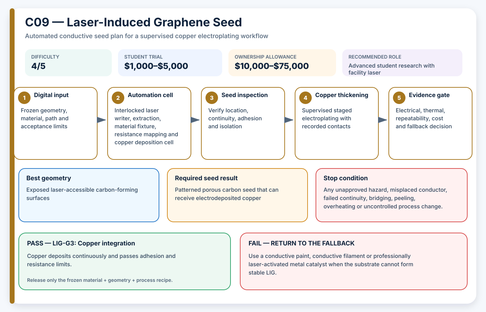

# C09 — Laser-Induced Graphene Seed

**Acronym:** LIG · **Difficulty:** 4/5 — advanced · **Student trial allowance:** USD $1,000–$5,000 · **Ownership allowance:** USD $10,000–$75,000

[← Conductive Coating Methods](index.md)

## Three-Paragraph Description

Laser-Induced Graphene, abbreviated LIG, is a porous carbon-rich conductive material formed when a suitable polymer or precursor coating is locally converted by a laser. The name describes both the energy source and the graphitic product. In AE3PT the laser-written carbon network can act as a patterned electrode or a seed for later copper electrodeposition, potentially avoiding a separately printed metal ink.

LIG is attractive because the electrical pattern is digitally written and the porous surface can provide many nucleation sites for metal deposition. The process is material-specific: polyimide is widely used in research, while other polymers may need a carbon-forming coating or tailored formulation. Laser wavelength, power, speed, focus, atmosphere and repeat passes affect conductivity, adhesion, pore structure and polymer damage.

A student should undertake LIG only with an approved enclosed laser and a tightly bounded coupon program. The useful questions are whether the selected printable substrate or coating can form a continuous path, whether that path survives bending and handling, and whether copper deposits evenly without delamination. Hidden channels and surfaces outside laser line-of-sight remain unsuitable, and the project must keep carbonisation fumes and fire risk under formal laboratory control.

## Student Planning Card

| Planning field | Project value |
|---|---|
| Method identifier | C09 |
| Expanded name | Laser-Induced Graphene Seed |
| Acronym | LIG |
| Difficulty | 4/5 — advanced |
| Student trial allowance | USD $1,000–$5,000 |
| Ownership or capital allowance | USD $10,000–$75,000 |
| Best geometry | Exposed laser-accessible carbon-forming surfaces |
| Automation level | Enclosed laser writing followed by copper deposition |
| Recommended role | Advanced student research with facility laser |

The allowances are AE3PT planning envelopes in 2026 United States dollars, not supplier quotations. They include representative fixtures, guarding, extraction and qualification work, exclude routine labour and building services, and must be replaced by local written quotations before money is released.

## Operating Principle

**Process principle:** A laser locally carbonises a compatible polymer or coating into a conductive porous graphitic path.

**Automation cell:** Interlocked laser writer, extraction, material fixture, resistance mapping and copper deposition cell

**Required output:** Patterned porous carbon seed that can receive electrodeposited copper

The coating is a **seed layer**: a thin electrically active starting surface. It is not automatically the final current-carrying conductor. The supervised electroplating stage adds the copper thickness required by the electrical and thermal design.

## Required Equipment

- interlocked laser engraver or research laser facility
- wavelength and focus control
- fume extraction with material-specific filtration
- fire-resistant coupon fixture
- microscope and surface-profile measurement
- four-wire resistance mapping
- low-current copper electrodeposition cell

## Required Materials

- polyimide or approved carbon-forming precursor coating
- printed support or laminate coupons
- clean electrical contact materials
- copper-plating electrolyte under laboratory control
- sealed carbonaceous waste containers

## Prerequisites

- laser and fume-risk approval
- material-specific literature and supplier review
- parameter matrix with conservative energy limits
- defined resistance, adhesion and fire-damage criteria

## Complete Implementation Microsteps

1. Select one substrate or carbon-forming coating and freeze its thickness.
2. Design a laser matrix covering power, speed, focus and pass count.
3. Commission extraction and a fire-safe fixture under facility rules.
4. Write reference lines and stop immediately on flaming or uncontrolled smoke.
5. Measure line width, surface profile and end-to-end resistance.
6. Select a process window that balances conductivity and substrate integrity.
7. Write three conductor coupons and one shaped coupon.
8. Test adhesion, bending or handling durability as appropriate.
9. Attach distributed contacts and begin copper deposition at low current.
10. Measure copper coverage, mass gain, resistance and adhesion.
11. Compare the copper-LIG path with painted and conductive-filament seeds.
12. Release only if material, laser and plating evidence are reproducible.

## Pass/Fail Gates

| Gate | Decision | Pass condition | Fail action |
|---|---|---|---|
| LIG-G0 | Laser and fire safety | Interlocks, extraction, material approval and fire response pass review. | Do not laser-carbonise the material. |
| LIG-G1 | Conductive conversion | Three laser-written coupons meet resistance and dimensional limits without unacceptable damage. | Change precursor, power, speed, focus or pass count. |
| LIG-G2 | Mechanical survival | The seed remains continuous after the defined handling or bending test. | Change substrate, pattern or protective design. |
| LIG-G3 | Copper integration | Copper deposits continuously and passes adhesion and resistance limits. | Return to a metal-bearing seed or modify contact distribution. |

A gate is passed only by current evidence from the frozen material, geometry and process recipe. A result from another substrate, previous bath, different machine file or unrecorded operator adjustment cannot release the next stage.

## Safety and Process Controls

| Main risk | Required control |
|---|---|
| Fire and hot carbon | Use a fire-resistant fixture, interlocked enclosure and trained operator. |
| Carbonisation fumes | Use material-specific extraction and prohibit unknown polymers. |
| Fragile porous trace | Use protected geometry and perform handling tests before plating. |
| Non-uniform copper growth | Use distributed contacts, staged current and agitation approved by the laboratory. |

Any abnormal heat, smell, gas, smoke, colour change, electrical behaviour, equipment sound or solution condition is a stop signal. Students make no independent substitutions to coatings, catalysts, plating baths, cleaning agents or laser settings.

## Minimum Evidence Package

- material and laser approval
- laser parameter matrix
- line-width and surface-profile maps
- pre-plating resistance distribution
- handling or bend-test evidence
- copper mass, coverage and resistance
- comparison with lower-risk seed routes

## Cost-Control Plan

1. Buy or book only enough capacity for flat and shaped coupons.
2. Pass the safety and path-control gate before consuming conductive material.
3. Pass the seed gate before using copper bath time.
4. Require three independently prepared results before purchasing upgrades.
5. Compare cost per passing sample, not cost per machine hour or cost per printed part.
6. Preserve a lower-cost fallback in the design so one failed process does not end the project.

## Fallback

Use a conductive paint, conductive filament or professionally laser-activated metal catalyst when the substrate cannot form stable LIG.

## Research Basis

- [Laser-induced graphene and copper deposition on printed polyimides](https://doi.org/10.1002/admt.202401801)

These readings establish technical plausibility and important process variables; they do not certify the student apparatus, chemistry, material combination or final part.

## Final Decision Rule

Adopt LIG only when it produces repeatable seed continuity, controlled isolation, acceptable adhesion and successful copper thickening at a cost and safety level justified by geometry that a simpler method cannot meet. Otherwise record the result, preserve the evidence and return to the stated fallback.
