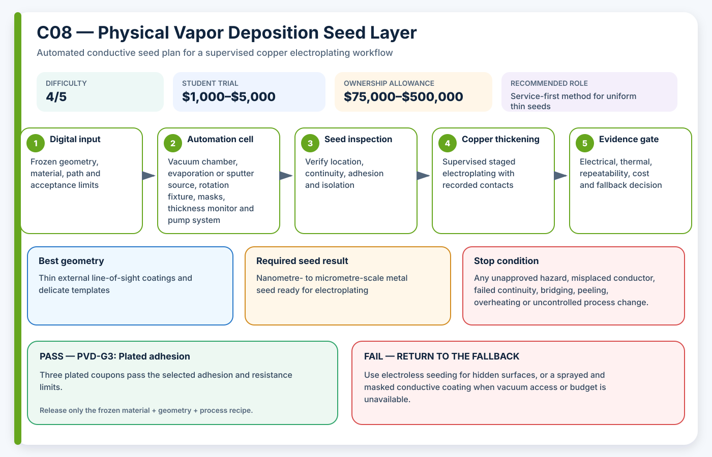

# C08 — Physical Vapor Deposition Seed Layer

**Acronym:** PVD · **Difficulty:** 4/5 — advanced · **Student trial allowance:** USD $1,000–$5,000 · **Ownership allowance:** USD $75,000–$500,000

[← Conductive Coating Methods](index.md)

## Three-Paragraph Description

Physical Vapor Deposition, abbreviated PVD, transfers material from a solid source through a vacuum and condenses it as a thin film on the part. Common PVD families include evaporation and sputtering. In AE3PT a thin titanium, chromium, copper or multilayer film can serve as an adherent conductive seed that is later thickened by electroplating.

PVD can produce clean, thin and well-controlled coatings without immersing the polymer in an activation bath, and published template processes have combined sputtered titanium-copper seed layers with subsequent copper electroplating. However, deposition is mainly line-of-sight. Deep channels, downward-facing surfaces and severe undercuts may receive little metal unless the part is rotated or multiple sources are used, and vacuum compatibility limits polymer choice, part size and trapped volumes.

A student project should use a university vacuum facility or commercial coater. The student should design witness coupons, masks, rotation fixtures and electrical contacts, then compare film continuity before plating and adhesion after plating. The apparent capital cost is not the only concern: pump maintenance, targets, chamber cleaning, fixturing, staff time and contamination policy make ownership unrealistic for most hobby projects.

## Student Planning Card

| Planning field | Project value |
|---|---|
| Method identifier | C08 |
| Expanded name | Physical Vapor Deposition Seed Layer |
| Acronym | PVD |
| Difficulty | 4/5 — advanced |
| Student trial allowance | USD $1,000–$5,000 |
| Ownership or capital allowance | USD $75,000–$500,000 |
| Best geometry | Thin external line-of-sight coatings and delicate templates |
| Automation level | Vacuum deposition through a facility or service |
| Recommended role | Service-first method for uniform thin seeds |

The allowances are AE3PT planning envelopes in 2026 United States dollars, not supplier quotations. They include representative fixtures, guarding, extraction and qualification work, exclude routine labour and building services, and must be replaced by local written quotations before money is released.

## Operating Principle

**Process principle:** Vacuum-transported metal atoms condense on exposed surfaces to form a thin conductive seed film.

**Automation cell:** Vacuum chamber, evaporation or sputter source, rotation fixture, masks, thickness monitor and pump system

**Required output:** Nanometre- to micrometre-scale metal seed ready for electroplating

The coating is a **seed layer**: a thin electrically active starting surface. It is not automatically the final current-carrying conductor. The supervised electroplating stage adds the copper thickness required by the electrical and thermal design.

## Required Equipment

- qualified evaporation or sputtering facility
- vacuum-compatible part fixture and rotation
- shadow masks or removable resist
- film-thickness monitor
- surface cleaning or plasma treatment
- four-wire continuity fixture
- electroplating contacts designed for a fragile seed

## Required Materials

- approved polymer with low outgassing
- titanium, chromium, copper or specified target material
- witness slides and masked step-height coupons
- vacuum-compatible masking and fixturing
- clean packaging for transfer to plating

## Prerequisites

- facility contamination and material approval
- vacuum outgassing review
- line-of-sight coverage analysis
- defined thickness, continuity and adhesion limits

## Complete Implementation Microsteps

1. Choose the adhesion layer, conductive layer and target thickness.
2. Model or inspect line-of-sight access for every required surface.
3. Design witness coupons and a fixture that exposes critical orientations.
4. Clean and dry parts using the facility-approved sequence.
5. Run a low-risk witness deposition before full shaped parts.
6. Measure film thickness, continuity and resistance on witness locations.
7. Deposit three shaped coupons with the frozen fixture and rotation.
8. Inspect shadowed regions and isolation-mask boundaries.
9. Attach plating contacts without scratching or burning the thin seed.
10. Electroplate in staged current increments.
11. Test plated adhesion, thickness and electrical performance.
12. Compare service yield and coating access against electroless methods.

## Pass/Fail Gates

| Gate | Decision | Pass condition | Fail action |
|---|---|---|---|
| PVD-G0 | Vacuum compatibility | Facility approves polymer, adhesives, trapped volumes and cleanliness. | Choose an electroless or surface-applied seed. |
| PVD-G1 | Seed coverage | All required witness zones meet minimum thickness and continuity. | Change rotation, source angle, masking or geometry. |
| PVD-G2 | Contact survival | The thin seed accepts plating current without local burnout or peeling. | Redesign contacts or deposit a thicker seed. |
| PVD-G3 | Plated adhesion | Three plated coupons pass the selected adhesion and resistance limits. | Change surface preparation or adhesion-layer material. |

A gate is passed only by current evidence from the frozen material, geometry and process recipe. A result from another substrate, previous bath, different machine file or unrecorded operator adjustment cannot release the next stage.

## Safety and Process Controls

| Main risk | Required control |
|---|---|
| Vacuum-system hazards | Facility operators own high voltage, vacuum, cooling and maintenance. |
| Polymer outgassing | Pre-dry approved materials and use witness monitoring. |
| Shadowed coating | Use rotation, multiple orientations and explicit geometry exclusions. |
| Seed damage in handling | Use clean carriers, protected contact tabs and minimum handling. |

Any abnormal heat, smell, gas, smoke, colour change, electrical behaviour, equipment sound or solution condition is a stop signal. Students make no independent substitutions to coatings, catalysts, plating baths, cleaning agents or laser settings.

## Minimum Evidence Package

- facility material acceptance
- fixture and line-of-sight drawing
- target, pressure, power and deposition record
- witness thickness measurements
- seed continuity and isolation map
- post-plating adhesion and resistance
- service cost, yield and lead time

## Cost-Control Plan

1. Buy or book only enough capacity for flat and shaped coupons.
2. Pass the safety and path-control gate before consuming conductive material.
3. Pass the seed gate before using copper bath time.
4. Require three independently prepared results before purchasing upgrades.
5. Compare cost per passing sample, not cost per machine hour or cost per printed part.
6. Preserve a lower-cost fallback in the design so one failed process does not end the project.

## Fallback

Use electroless seeding for hidden surfaces, or a sprayed and masked conductive coating when vacuum access or budget is unavailable.

## Research Basis

- [Vapor-deposited seed layers for electrodeposition on printed polymers](https://digitalcommons.unf.edu/etd/934/)

These readings establish technical plausibility and important process variables; they do not certify the student apparatus, chemistry, material combination or final part.

## Final Decision Rule

Adopt PVD only when it produces repeatable seed continuity, controlled isolation, acceptable adhesion and successful copper thickening at a cost and safety level justified by geometry that a simpler method cannot meet. Otherwise record the result, preserve the evidence and return to the stated fallback.
