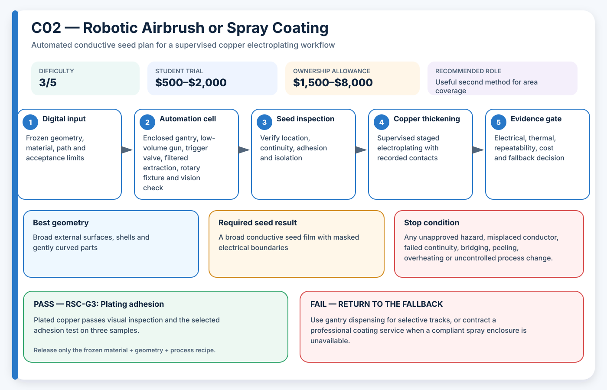

# C02 — Robotic Airbrush or Spray Coating

**Acronym:** RSC · **Difficulty:** 3/5 — intermediate · **Student trial allowance:** USD $500–$2,000 · **Ownership allowance:** USD $1,500–$8,000

[← Conductive Coating Methods](index.md)

## Three-Paragraph Description

Robotic spray coating uses a programmed airbrush or low-volume spray gun to apply a thin conductive coating over a selected surface. The acronym RSC means Robotic Spray Coating and describes the automation cell rather than a particular paint chemistry. In AE3PT the process creates a conductive seed film that can later receive thicker copper by electroplating, while masks or removable films protect areas that must remain non-conductive.

Spray deposition is faster than point-by-point dispensing for large areas and can produce a smoother film on broad curves. A low-cost cell can combine a guarded X-Y-Z gantry, an indexed rotary table, a trigger solenoid, a camera and local exhaust ventilation. Coverage is influenced by nozzle distance, angle, overlap, atomising pressure, part rotation, coating viscosity and drying time, so automation is valuable only when those variables are measured and frozen.

The educational challenge is to distinguish apparent visual coverage from verified electrical and plating performance. Students should construct a coupon set with flat, convex and recessed surfaces, then map thickness, sheet resistance and adhesion. The method is not preferred for narrow isolated traces unless masking is precise, and it should never be operated with an unapproved coating or inadequate extraction merely because the spray mechanism itself appears mechanically simple.

## Student Planning Card

| Planning field | Project value |
|---|---|
| Method identifier | C02 |
| Expanded name | Robotic Airbrush or Spray Coating |
| Acronym | RSC |
| Difficulty | 3/5 — intermediate |
| Student trial allowance | USD $500–$2,000 |
| Ownership or capital allowance | USD $1,500–$8,000 |
| Best geometry | Broad external surfaces, shells and gently curved parts |
| Automation level | Three-axis spray cell with indexed part rotation |
| Recommended role | Useful second method for area coverage |

The allowances are AE3PT planning envelopes in 2026 United States dollars, not supplier quotations. They include representative fixtures, guarding, extraction and qualification work, exclude routine labour and building services, and must be replaced by local written quotations before money is released.

## Operating Principle

**Process principle:** A moving spray cone deposits overlapping passes while a fixture controls surface angle and stand-off distance.

**Automation cell:** Enclosed gantry, low-volume gun, trigger valve, filtered extraction, rotary fixture and vision check

**Required output:** A broad conductive seed film with masked electrical boundaries

The coating is a **seed layer**: a thin electrically active starting surface. It is not automatically the final current-carrying conductor. The supervised electroplating stage adds the copper thickness required by the electrical and thermal design.

## Required Equipment

- enclosed motion frame or guarded robot
- low-volume airbrush or spray gun
- regulated clean-air supply
- solenoid trigger and flow controller
- rotary indexing fixture
- filtered local exhaust ventilation
- wet-film or dry-film thickness measurement method

## Required Materials

- laboratory-approved conductive coating
- masking film, plugs and removable resist
- flat, convex and recessed coupons
- cleaning solvent or water specified by the coating supplier
- overspray filters and controlled waste containers

## Prerequisites

- approved spray-booth or enclosure assessment
- coating and cleaning chemical review
- air-pressure limit and leak test
- defined overspray, adhesion and sheet-resistance acceptance limits

## Complete Implementation Microsteps

1. Design flat, curved and recessed coupons with identical plated areas.
2. Qualify the spray enclosure, filters, grounding and emergency isolation.
3. Calibrate gun flow and pattern using water or another harmless surrogate.
4. Program stand-off distance, angle, pass overlap and indexed part rotation.
5. Verify masking registration with a dry visual trial.
6. Spray three coupons at each selected process setting.
7. Dry or cure without exceeding the polymer temperature limit.
8. Measure thickness variation, sheet resistance, edge definition and adhesion.
9. Electroplate the best coupon under the approved laboratory recipe.
10. Inspect copper coverage, bridging, blistering and masked boundaries.
11. Repeat the winning recipe on three independently prepared parts.
12. Release only the geometry classes that passed; keep recess and undercut exclusions explicit.

## Pass/Fail Gates

| Gate | Decision | Pass condition | Fail action |
|---|---|---|---|
| RSC-G0 | Ventilation release | Extraction, filter loading, grounding and spill controls pass laboratory inspection. | Do not spray; use dispensing or an external coating service. |
| RSC-G1 | Coverage uniformity | Dry-film thickness and sheet resistance remain within the chosen limits across all measured zones. | Change spray angle, rotation, overlap or coating dilution. |
| RSC-G2 | Boundary control | Mask edges remain isolated and no unacceptable overspray reaches protected regions. | Redesign masks or choose a trace-deposition method. |
| RSC-G3 | Plating adhesion | Plated copper passes visual inspection and the selected adhesion test on three samples. | Stop and improve cleaning, surface texture or seed curing. |

A gate is passed only by current evidence from the frozen material, geometry and process recipe. A result from another substrate, previous bath, different machine file or unrecorded operator adjustment cannot release the next stage.

## Safety and Process Controls

| Main risk | Required control |
|---|---|
| Inhalation and flammability | Use only approved materials inside a compliant exhausted enclosure; remove ignition sources. |
| Overspray contamination | Use replaceable filters, enclosed fixtures and documented cleaning. |
| Shadowed surfaces | Rotate the part, add angled passes and define prohibited geometry. |
| Mask leakage | Use witness coupons and electrical isolation checks before plating. |

Any abnormal heat, smell, gas, smoke, colour change, electrical behaviour, equipment sound or solution condition is a stop signal. Students make no independent substitutions to coatings, catalysts, plating baths, cleaning agents or laser settings.

## Minimum Evidence Package

- spray-cell risk assessment
- air pressure, flow and path settings
- thickness and sheet-resistance maps
- mask-boundary photographs
- adhesion results before and after plating
- filter and waste records
- repeatability and cost summary

## Cost-Control Plan

1. Buy or book only enough capacity for flat and shaped coupons.
2. Pass the safety and path-control gate before consuming conductive material.
3. Pass the seed gate before using copper bath time.
4. Require three independently prepared results before purchasing upgrades.
5. Compare cost per passing sample, not cost per machine hour or cost per printed part.
6. Preserve a lower-cost fallback in the design so one failed process does not end the project.

## Fallback

Use gantry dispensing for selective tracks, or contract a professional coating service when a compliant spray enclosure is unavailable.

## Research Basis

- [Rapid 3D-Plastronics selective metallization](https://doi.org/10.1016/j.addma.2023.103673)
- [Direct electroless plating of conductive thermoplastics](https://doi.org/10.1016/j.addma.2022.102793)

These readings establish technical plausibility and important process variables; they do not certify the student apparatus, chemistry, material combination or final part.

## Final Decision Rule

Adopt RSC only when it produces repeatable seed continuity, controlled isolation, acceptable adhesion and successful copper thickening at a cost and safety level justified by geometry that a simpler method cannot meet. Otherwise record the result, preserve the evidence and return to the stated fallback.
