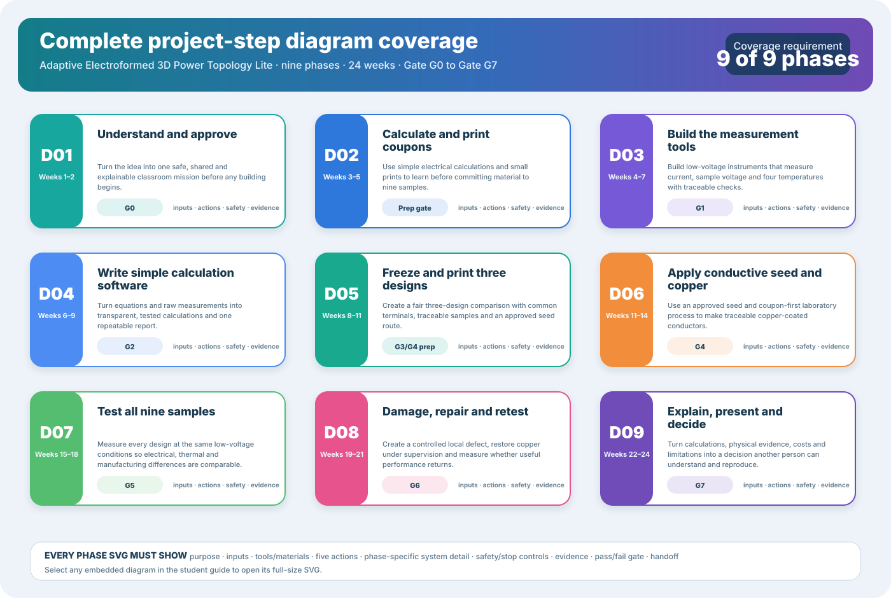
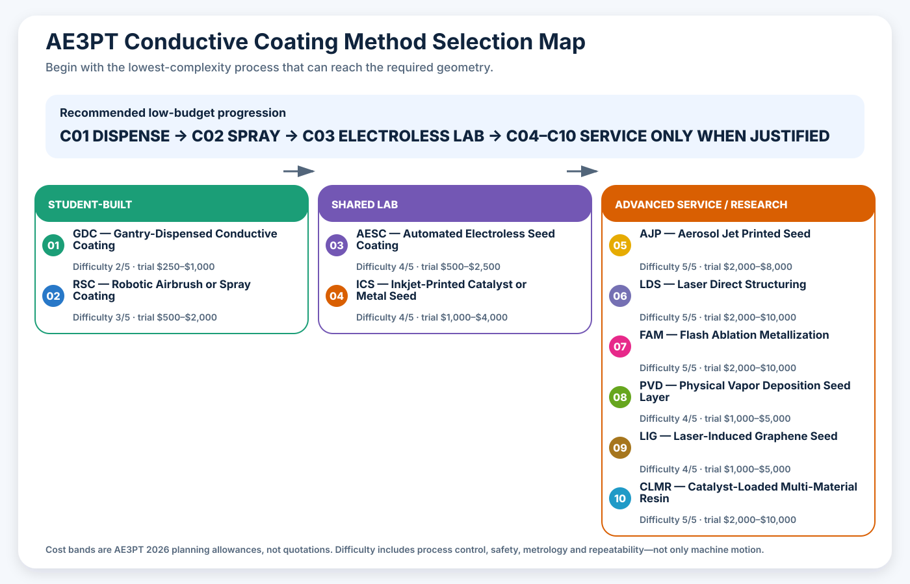

# Adaptive Electroformed 3D Power Topology Lite (AE3PT-Lite): Project Diagram Implementation and Coverage Plan

## Eleven Accessible Phase Graphics Plus a Companion Conductive-Coating Diagram Library

> **Purpose:** Provide a complete visual explanation of the 24-week project so a first-year student, lecturer, laboratory supervisor, or business funder can see what enters each phase, what students do, what can stop the work, what evidence is produced, and what must pass before the next phase.

**Scalable Vector Graphics**, abbreviated **SVG**, is a text-based image format that stays sharp when enlarged. Each diagram can therefore be used in the website, a lecture slide, a printed poster, or a full-size browser view without creating a separate raster image.

The generated phase-diagram register is [`data/student-diagram-manifest.csv`](data/student-diagram-manifest.csv). Its source specification and generator are maintained in `tools/build_project_diagrams.py`. The companion conductive-coating register is [`data/conductive-coating-methods.csv`](data/conductive-coating-methods.csv), generated with eleven additional SVG files by `tools/build_coating_method_plans.py`.

[](diagrams/student-project-step-map.svg)

*Select the coverage map or any phase diagram in the [First-Year Student Project Guide](student-project.md#17-twenty-four-week-plan) to open its full-size SVG. The optional Artist-D workflow is linked from the printing sections of the student and construction guides.*

[](diagrams/conductive-coatings/method-selection-map.svg)

*Select the coating-method map to open the complete comparison. Every method page also contains its own input-to-evidence diagram.*

---

## 1. Authoritative Project Steps

The diagram set is based on the nine teaching phases in the student guide. The timeline remains the authority for overlapping weeks; the diagram manifest remains the authority for visual coverage.

| Diagram | Project phase | Weeks | Gate | SVG file |
|---|---|---|---|---|
| D01 | understand and approve | 1–2 | G0 | `step-01-understand-approve.svg` |
| D02 | calculate and print coupons | 3–5 | preparation gate | `step-02-calculate-coupons.svg` |
| D03 | build measurement tools | 4–7 | G1 | `step-03-build-loggers.svg` |
| D04 | write simple software | 6–9 | G2 | `step-04-write-software.svg` |
| D05 | freeze and print designs | 8–11 | G3 and G4 preparation | `step-05-freeze-print-designs.svg` |
| D06 | apply conductive seed and copper | 11–14 | G4 | `step-06-seed-plate.svg` |
| D07 | test all nine samples | 15–18 | G5 | `step-07-test-samples.svg` |
| D08 | damage, repair and retest | 19–21 | G6 | `step-08-damage-repair.svg` |
| D09 | explain, present and decide | 22–24 | G7 | `step-09-explain-present.svg` |

The tenth diagram, `student-project-step-map.svg`, proves that all nine phases are represented and provides a visual index. The eleventh diagram, `artist-d-dual-material-plating-workflow.svg`, explains the optional Independent Dual Extrusion printing route and its three coupon gates. It supplements D05 and D06 but does not create a tenth project phase.

---

## 2. Required Content in Every Phase Diagram

Every detailed SVG must contain all of the following:

1. **purpose** — why the phase exists;
2. **inputs** — information, samples, parts, or approvals needed before starting;
3. **tools and materials** — the principal equipment or software used;
4. **student action flow** — five ordered actions;
5. **phase-specific system detail** — a visual model unique to that phase;
6. **safety and stop controls** — conditions that pause or prohibit work;
7. **evidence produced** — records and artifacts required for assessment;
8. **pass/fail gate** — the decision that controls release;
9. **handoff** — what the next phase receives.

This prevents a diagram from becoming decorative artwork that omits the evidence or safety needed to run the project.

---

## 3. Phase-Specific Visual Requirements

### D01 — Understand and approve

Show the mission, team roles, risk controls, fixed classroom limits, lecturer approval, laboratory approval, and Gate G0.

### D02 — Calculate and print coupons

Show the area, resistance and heating relationships plus the Computer-Aided Design–print–measure–update loop.

### D03 — Build measurement tools

Show the protected current path, fuse, switch, sample, load, current shunt, separate voltage sensing, temperature sensing, microcontroller, raw-data output, calibration, and stop logic.

### D04 — Write simple software

Show mission, geometry and raw-data inputs; calculation modules; analysis and reporting; automated tests; and the rule that software cannot override physical safety controls.

### D05 — Freeze and print designs

Show visible differences between Designs A, B and C, common terminals, voltage-sense points, repair access, the nine sample identifiers, design freeze, traceability, and the optional Artist-D material assignment.

### D06 — Apply conductive seed and copper

Show the polymer–seed–copper cross-section, printed or surface-applied seed, coupon-first process, resistance and voltage-drop checking, laboratory plating, inspection, process records, and waste ownership.

### Artist-D equipment reference

Show the Independent Dual Extruder machine role, left non-conductive PLA assignment, right conductive-PLA seed assignment, co-printed cross-section, alignment and isolation gate, electrical-seed gate, supervised-plating coupon gate, pass route, fail route, and laboratory safety boundary.

### D07 — Test all nine samples

Show randomized sample order, repeatable four-wire connection, the three current levels, temperature monitoring, stop conditions, repeated measurement, raw data, uncertainty, and comparison outputs.

### D08 — Damage, repair and retest

Show original, damaged and repaired states, the controlled damage zone, repair mask, local restoration, identical retesting, electrical and thermal criteria, material use, time, and cost.

### D09 — Explain, present and decide

Show calculations, physical samples, measurement data and costs flowing into a traceable evidence package, review by technical and non-technical readers, and the final stop, repeat, or expand decision.

---

## 4. Visual and Accessibility Standard

Every SVG must:

- include a descriptive `<title>` and `<desc>` element;
- use `role="img"` and connect its accessible title and description;
- use plain language and spell out new abbreviations in the surrounding document;
- use colour to organize information but never as the only indicator;
- show explicit labels for safety, evidence, gates, and handoffs;
- use a fixed view box so it scales without distortion;
- remain valid XML;
- contain no external fonts, scripts, bitmap images, or network dependencies;
- be linked to its full-size source when embedded in the student guide.

---

## 5. Implementation Sequence and Gates

### I0 — Freeze coverage

**Micro-steps:** extract the nine course phases; identify gate, inputs, actions, safety, evidence, and handoff; assign D01–D09.

**Pass:** every student phase has exactly one diagram identifier.

**Fail:** a phase is missing, duplicated, or represented only by the timeline.

### I1 — Define one source of truth

**Micro-steps:** place phase specifications in the generator; generate the CSV manifest from the same records; add a check mode that detects drift.

**Pass:** the manifest has nine unique identifiers and nine unique SVG paths.

**Fail:** a manually edited file differs from the generator output.

### I2 — Generate accessible SVGs

**Micro-steps:** create the coverage map; generate D01–D09; generate the Artist-D equipment reference; include accessible titles and descriptions; include every phase field and every equipment-option gate.

**Pass:** all eleven generated SVG files pass XML validation and accessibility-element checks.

**Fail:** invalid XML, missing labels, missing phase-specific content, or a network dependency.

### I3 — Integrate with the course

**Micro-steps:** embed the coverage map near the timeline; embed each phase diagram under its matching week heading; embed the Artist-D workflow in both printing guides; add full-size links and explanatory captions; add this plan to the HTML document tree.

**Pass:** all eleven generated images and their document links resolve in the generated website.

**Fail:** a diagram appears under the wrong phase or is absent from the generated bundle.

### I4 — Verify visual quality

**Micro-steps:** render the coverage map, Artist-D workflow, and representative electrical, manufacturing, testing, repair, and final-decision diagrams; inspect desktop and mobile page views; correct overflow, clipping, contrast, or unreadable labels.

**Pass:** the visual content is complete, unclipped, consistently styled, and available full size.

**Fail:** any required content is hidden or only understandable from colour.

### I5 — Audit complete coverage

**Micro-steps:** compare student headings with the manifest; compare manifest files with generated SVGs; compare SVG references with Markdown; run generator drift check; rerun the complete documentation build and link audit.

**Pass:** nine of nine phases are covered and all eleven generated SVGs are valid, linked, current, and represented in the generated site.

**Fail:** any phase, file, reference, accessible description, or gate is missing.

---

## 6. Lecturer Notes

- Introduce the coverage map before the detailed timeline.
- Open only the current phase diagram during weekly briefings.
- Ask students to point to the input, stop control, evidence, and gate before practical work.
- Treat a diagram mismatch as a documentation defect that must be corrected before release.
- Let students annotate printed copies, but keep the generated SVG as the controlled baseline.

---

## 7. Business Funder Notes

The diagram set shows where money is released, what evidence each phase purchases, where safety or quality can stop spending, and what decision follows. The coverage map is not a promise that every phase will pass. It is a transparent representation of how failure, correction, and staged funding are managed.

---

## 8. Maintenance Command

Generate the files:

```text
python3 tools/build_project_diagrams.py
```

Check that generated files still match the specification:

```text
python3 tools/build_project_diagrams.py --check
```

Do not edit generated phase SVGs or the manifest by hand. Change the phase specification, regenerate, validate, rebuild the document bundle, and inspect the rendered result.

---

## 9. Completion Evidence

The implementation is complete only when current validation proves:

- one coverage map exists;
- nine detailed phase SVGs exist;
- one Artist-D equipment workflow SVG exists;
- the manifest contains exactly nine matching rows;
- all eleven generated SVGs pass XML validation;
- all eleven contain accessible titles and descriptions;
- each student phase contains its matching linked image and caption;
- the Artist-D workflow is linked from both printing guides;
- the implementation plan appears in the HTML document tree;
- generator check mode reports no drift;
- desktop and mobile renderings pass visual inspection;
- the complete documentation regression suite still passes.
