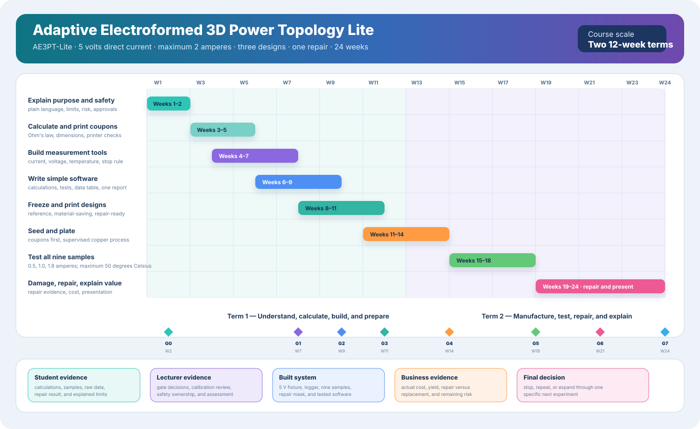
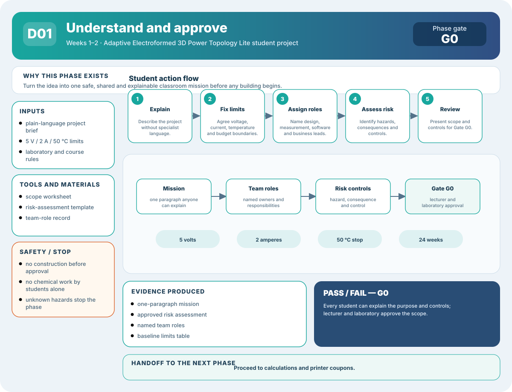
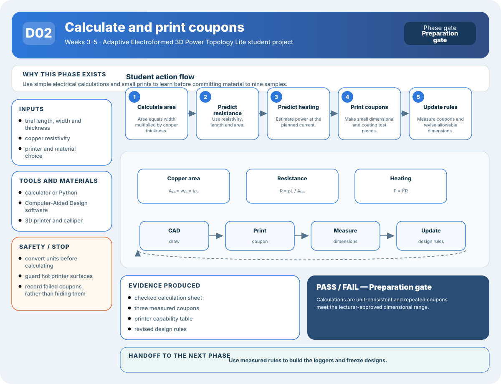
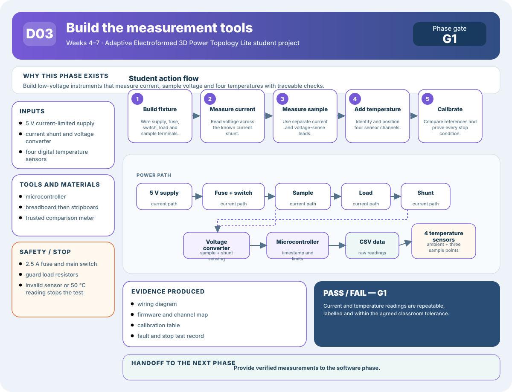
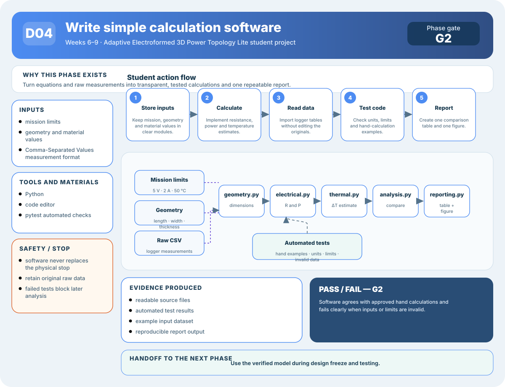
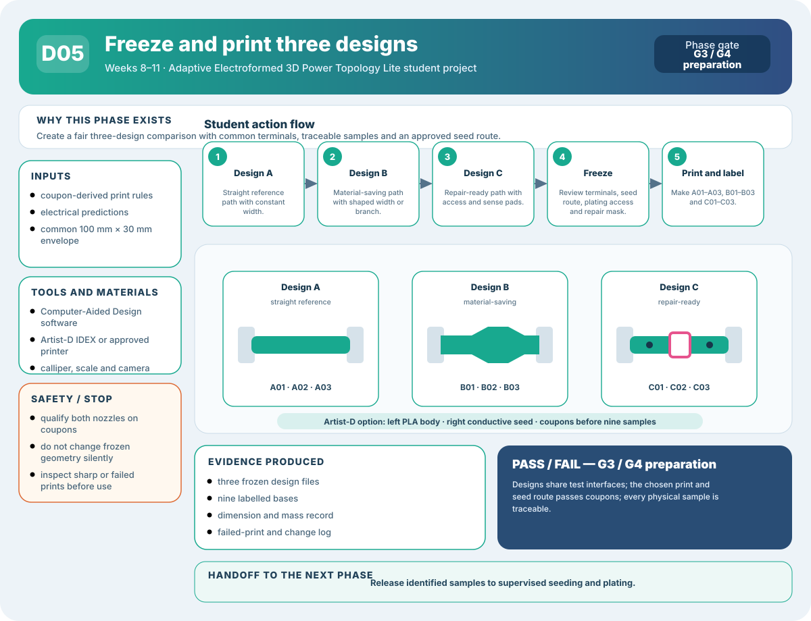
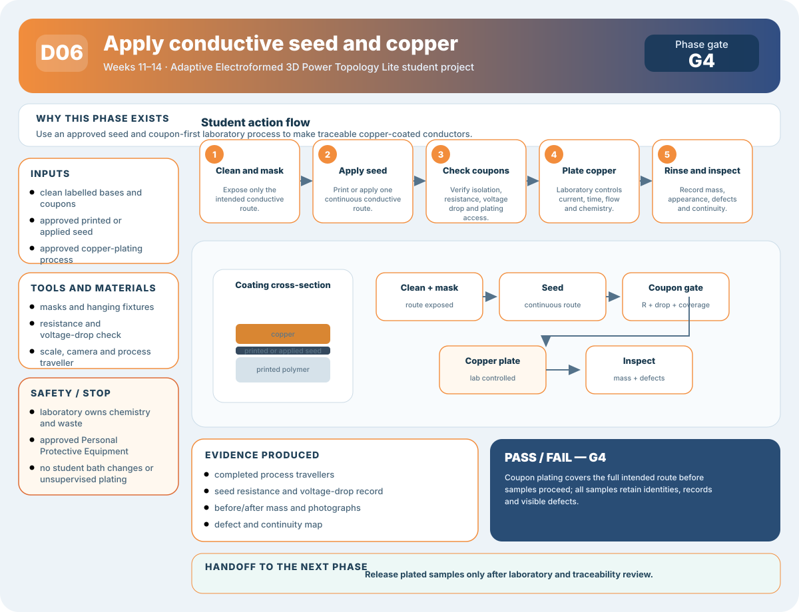
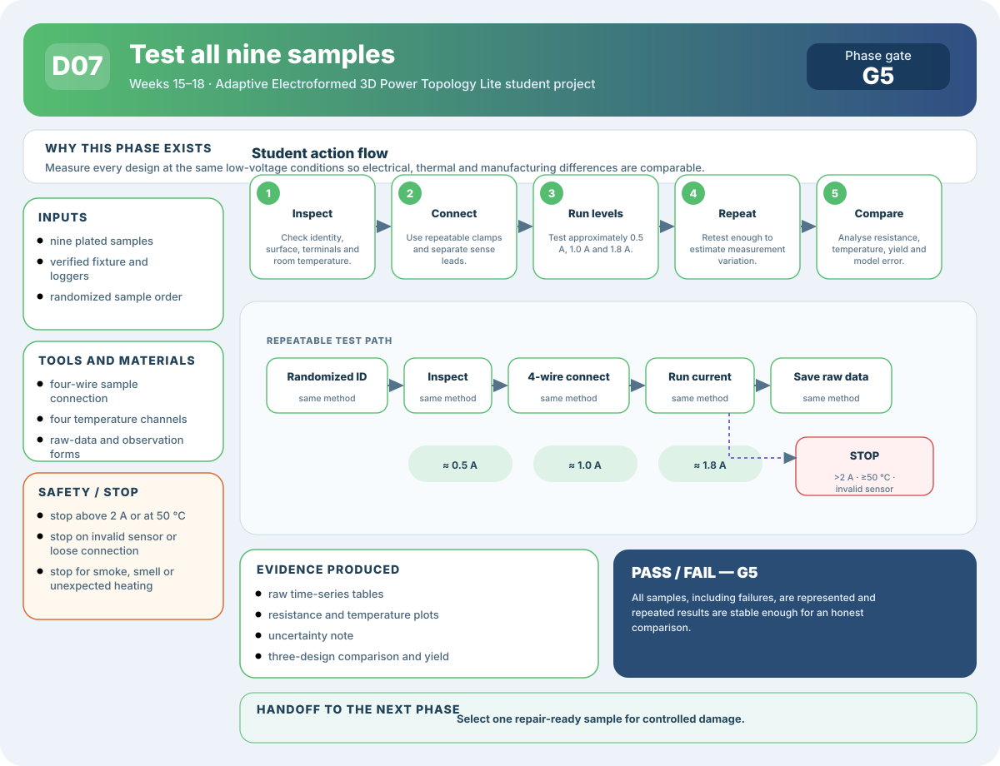
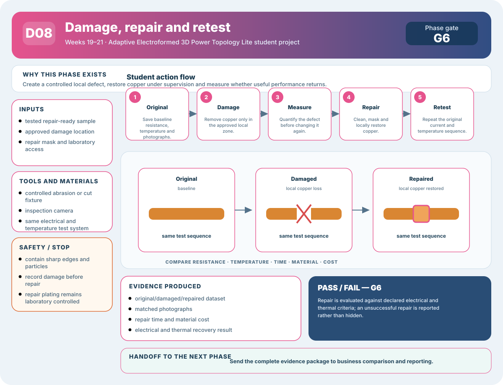
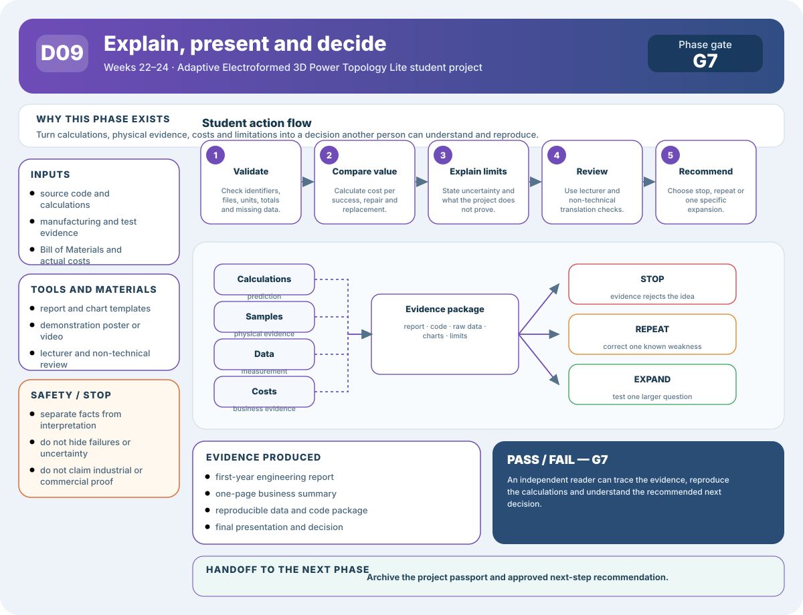

# Adaptive Electroformed 3D Power Topology Lite (AE3PT-Lite): First-Year Student Project Guide

## Design, Make, Test, Damage, Repair, and Explain a Five-Volt Copper-Coated Conductor

> **Start here:** You do not need previous knowledge of copper coating, electrical distribution paths, computer calculation models, or business finance. Each idea is explained before you use it.

**AE3PT-Lite** means **Adaptive Electroformed 3D Power Topology Lite**. The words are explained again in Section 2 so that you can connect the name to the physical project.



[](diagrams/student-project-step-map.svg)

*Visual roadmap — every phase below has its own detailed diagram. Select a diagram to open the full-size Scalable Vector Graphics (SVG) file.*

In this project, you will make a plastic part with a copper-coated electrical path. You will compare three shapes, measure how well they carry current, damage one shape, repair it, and explain whether the repair was technically and financially worthwhile.

The complete project uses five volts of direct current and no more than two amperes. It is a classroom demonstration, not a product for mains electricity, vehicles, motors, or industrial power systems.

---

## 1. The Project in Everyday Language

Electricity moves through paths made from conducting materials such as copper. A **conductor** is a material that allows electric charge to move easily. A **busbar** is a conductor used to distribute electrical current between connection points.

Instead of cutting the whole busbar from thick copper, this project:

1. prints the supporting shape from plastic;
2. adds a thin conductive starting layer;
3. coats the selected surface with copper;
4. tests the finished path;
5. repairs a deliberately damaged area.

The project asks whether shape and repair access can reduce wasted material without causing unacceptable heat or electrical loss.

---

## 2. What the Name Means

**AE3PT-Lite** means **Adaptive Electroformed 3D Power Topology Lite**.

- **Adaptive:** the design changes after a calculation or measurement shows a problem.
- **Electroformed:** metal is built by electrical deposition. In this small project, **electroplating** is the more exact process because copper remains attached to the plastic base.
- **3D:** three-dimensional.
- **Power:** electrical energy is being transferred.
- **Topology:** the pattern of connections and paths.
- **Lite:** a smaller teaching version of a much larger research idea.

The acronym was created for this project. It is not an international standard.

---

## 3. What You Will Learn

By the end, you should be able to:

- explain voltage, current, resistance, power, and temperature rise;
- turn a simple requirement into three physical designs;
- use Computer-Aided Design, abbreviated CAD, to make printable shapes;
- build a low-voltage data logger;
- write a small program in the Python programming language;
- measure three repeated samples of each design;
- compare prediction with measurement;
- explain **measurement uncertainty**, meaning reasonable doubt about a measured value;
- judge repair against replacement;
- explain the project to a non-technical business person.

---

## 4. The Fixed Classroom Limits

**VDC** means **Volts Direct Current**. **A** means amperes, the unit of electrical current. **°C** means degrees Celsius, a temperature scale.

| Limit | Value |
|---|---:|
| Supply | 5 VDC |
| Maximum current | 2 A |
| Normal test points | approximately 0.5 A, 1.0 A, and 1.8 A |
| Maximum measured surface temperature | 50 °C |
| Functional sample length | approximately 100 mm |
| Functional sample width | approximately 30 mm |
| Number of designs | 3 |
| Samples per design | 3 |
| Required repair cycles | 1 |
| Course duration | 24 teaching weeks |

> **Safety gate:** Low voltage does not remove every hazard. Hot resistors, sharp copper, tools, chemicals, and waste still require lecturer and laboratory approval.

---

## 5. The Three Designs

### Design A — Straight reference

A **reference** is the ordinary design used for comparison. Design A uses a straight copper-coated strip with constant width.

### Design B — Material-saving path

Design B changes width or adds a branch so less material is used in some regions while enough copper remains in important regions.

### Design C — Repair-ready path

Design C includes a clearly marked repair area, voltage-sense pads, and space for a clip-on repair mask.

### Why three copies?

Three separately made copies are called **replicates**. They show manufacturing variation. Three repeated readings from one object are useful, but they are not three manufactured replicates.

### Sample names

```text
A01 A02 A03  straight reference
B01 B02 B03  material-saving path
C01 C02 C03  repair-ready path
```

Every photograph, data file, and chart must include the sample name.

---

## 6. The First Electrical Ideas

### Voltage

**Voltage** is the electrical push between two points. It is measured in volts, written V.

### Current

**Current** is the rate at which electric charge moves. It is measured in amperes, written A.

### Resistance

**Resistance** describes how strongly a path opposes current. It is measured in ohms, written Ω.

### Ohm’s law

Ohm’s law is named after Georg Ohm. It connects voltage, current, and resistance:

$$
V=IR
$$

If current and voltage are measured, resistance is:

$$
R=\frac{V}{I}
$$

### Power and heating

**Power** is the rate of energy transfer. It is measured in watts, written W.

Electrical heating can be estimated using:

$$
P=I^2R
$$

This is called **Joule heating**, named after James Prescott Joule. If current doubles and resistance stays the same, heating becomes four times larger.

> **Common mistake:** Do not assume five volts means there can be no heat. A low voltage can still produce hot wires or load resistors when current is high enough.

---

## 7. Predicting the Copper Path

For a simple uniform section:

$$
R=\rho\frac{L}{A}
$$

where:

- \(R\) is resistance;
- \(\rho\), pronounced “rho,” is the material’s electrical resistivity;
- \(L\) is length;
- \(A\) is cross-sectional area.

**Resistivity** describes how strongly a material resists current after length and area are accounted for.

For a thin rectangular copper layer, define the symbols before using them:

$$
A_{Cu}=w_{Cu}t_{Cu}
$$

where \(A_{Cu}\) is the copper cross-sectional area in square metres, \(w_{Cu}\) is copper width in metres, and \(t_{Cu}\) is copper thickness in metres.

Longer and thinner paths have more resistance. Wider and thicker paths use more copper but normally have less resistance.

### First hand calculation

Before writing software:

1. choose a trial length, width, and copper thickness;
2. convert millimetres to metres;
3. calculate area;
4. calculate resistance;
5. calculate power at 1 A;
6. ask whether the answer appears physically reasonable.

> **Practical tip:** Unit errors are more common than advanced mathematical errors. Write the unit beside every number.

---

## 8. Simple Software

Use Python, a widely used programming language with readable syntax.

### Minimum files

```text
ae3pt_lite/
├── mission.py
├── geometry.py
├── electrical.py
├── thermal.py
├── data_io.py
├── analysis.py
├── reporting.py
├── tests/
└── examples/
```

### What each file does

- `mission.py`: stores limits such as 5 V, 2 A, and 50 °C.
- `geometry.py`: stores length, width, and thickness.
- `electrical.py`: calculates resistance and power.
- `thermal.py`: makes a simple temperature-rise estimate.
- `data_io.py`: reads **Comma-Separated Values (CSV)** measurement files.
- `analysis.py`: compares designs and repair states.
- `reporting.py`: creates tables and charts.
- `tests/`: contains small automated checks.

### Automated test

An **automated test** is code that checks another piece of code and reports failure. Start with:

- a known straight-path calculation;
- two sections in series;
- two branches in parallel;
- zero current producing zero heating;
- negative dimensions being rejected.

### Pass gate

The software passes when the hand calculation and program agree, invalid inputs fail clearly, and the same input produces the same result twice.

---

## 9. A Simple Temperature Model

A complete heat simulation is not required. Use a simple model that predicts the general direction of temperature change.

The sample receives heat from electrical power and loses heat to the surrounding air.

At steady conditions, a simple estimate is:

$$
\Delta T\approx P\times R_{\theta}
$$

where:

- \(\Delta T\), pronounced “delta T,” is the estimated temperature rise;
- \(P\) is the electrical power converted to heat;
- \(R_{\theta}\), pronounced “R theta,” is thermal resistance.

**Thermal resistance** describes how difficult it is for heat to leave an object. It is an analogy to electrical resistance.

The model is expected to be imperfect. Its job is to predict which design is likely to run hotter and to make assumptions visible.

---

## 10. Building the Measurement Tools

Follow the detailed [Low-Power Construction Plan](low-budget-construction-plan.md).

### Voltage and current logger

The logger uses:

- a microcontroller;
- an Analog-to-Digital Converter, abbreviated ADC;
- a current shunt;
- separate voltage-sense wires;
- a Universal Serial Bus, abbreviated USB, connection to the computer.

A **current shunt** is a known low resistance. Measuring its voltage allows current to be calculated.

### Four-wire measurement

Two wires carry current and two separate wires measure sample voltage. This is a **four-wire** or **Kelvin** connection. The name honours William Thomson, Lord Kelvin.

### Temperature logger

Use four DS18B20 digital temperature sensors: ambient, input, centre, and output. DS18B20 is a manufacturer part number, not an acronym.

### Tool gate

Do not test plated samples until the fixture, logger, sensor labels, 50 °C stop, fuse, and power switch have passed on a safe reference link.

---

## 11. Printing the Samples

**Material extrusion** is a 3D-printing process that pushes softened filament through a nozzle and builds a part layer by layer.

Use the lecturer-approved polymer. Common options are:

- **PLA**, Polylactic Acid, for practice coupons;
- **PETG**, Polyethylene Terephthalate Glycol-modified, for functional fixtures when compatible with the approved plating process.

Record printer, nozzle, material batch, layer height, orientation, wall count, infill, support, print time, dimensions, and failures.

### Optional JG MAKER Artist-D route

The JG MAKER Artist-D has two independently moving direct-drive extruders. This arrangement is called **Independent Dual Extrusion (IDEX)**. The left extruder can print the non-conductive PLA body while the right extruder prints an exposed conductive-PLA seed track. The nominal build volume is 300 mm × 300 mm × 340 mm and the machine uses 1.75 mm filament. Retail descriptions may call it “98% assembled”; the official manual describes factory-preassembled base and gantry units but still requires final assembly, inspection, leveling, tool-offset calibration and test printing.

The overall Artist-D conductive-filament and copper-electroplating route is **difficulty 4/5**. Ordinary PLA printing is moderate, but two-head X/Y/Z alignment, conductive ooze control, material interfaces, seed resistance, plating contacts and uniform copper deposition are advanced coupled tasks.

[](diagrams/artist-d-dual-material-plating-workflow.svg)

Conductive filament is not the final power conductor. It is only an experimental seed that must distribute enough plating current for supervised copper deposition. Carbon-filled or metal-filled polymer may be thousands of times less conductive than copper, and generic “conductive PLA” can behave more like a resistor than a wire. Excess seed resistance causes voltage loss and current crowding, so copper may grow near the contact while the far end remains thin or bare.

Print and measure small alignment, isolation, resistance, contact, and plating coupons before using this method for the nine samples. If the coupon fails, use the ordinary printed body with the laboratory-approved surface seed. See the [complete Artist-D Dual-Material Copper Electroplating Plan](artist-d-electroplating-plan.md) and the [Low-Power Construction Plan](low-budget-construction-plan.md#jg-maker-artist-d-suitability) for specifications, material warnings, construction steps and pass/fail procedure.

### Coupon-first rule

Print small test coupons before the nine functional samples. A coupon is a small test piece used to learn a process cheaply.

---

## 12. Conductive Seed and Copper Plating

Plastic is normally electrically insulating. A **conductive seed layer** is a thin first coating that makes the selected surface conductive.

The seed can be applied after printing or printed selectively with the Artist-D. Both routes must pass the same supervised plating-coupon gate before functional samples are released.

The [Conductive Coating Methods library](conductive-coatings/index.md) provides ten complete automation plans with difficulty, trial cost, ownership cost, microsteps, diagrams, gates and fallbacks. For this project, begin with C01 gantry dispensing or the existing Artist-D seed route; treat advanced wet, laser, vacuum, inkjet and aerosol processes as supervised facility or service options.

**Electroplating** uses electrical current and an approved chemical process to deposit metal on a conductive surface.

Students may prepare labels, masks, fixtures, photographs, and process records. Chemistry, ventilation, exposure, electrical process settings, rinsing, storage, and waste remain controlled by the approved laboratory or service.

Record pre-plating mass, post-plating mass, plating time, permitted current and voltage, connection location, interruptions, and visible defects.

---

## 13. Testing the Three Designs

### Test order

If possible, mix the order of samples rather than testing all A samples, then all B samples, then all C samples. This is called **randomization** and helps reduce time-order bias.

### Test sequence

For each sample:

1. inspect and photograph;
2. measure mass and dimensions;
3. connect current and voltage-sense leads;
4. confirm temperature sensors;
5. test near 0.5 A;
6. test near 1.0 A;
7. test near 1.8 A only if lower steps pass;
8. stop at 50 °C or any abnormal condition;
9. save raw data;
10. allow cooling before the next sample.

### Raw data

Store time, sample name, state, current, sample voltage, resistance, four temperatures, notes, and software version.

**Raw data** means the original recorded values before manual correction or selection. Do not edit raw files by hand.

---

## 14. Measurement Uncertainty

No measurement is perfectly exact. **Measurement uncertainty** describes reasonable doubt about a result.

Possible sources include:

- ADC resolution;
- shunt-resistor tolerance;
- probe position;
- connector pressure;
- sensor attachment;
- ambient temperature;
- changes between repeated samples.

Report a result such as:

$$
R=0.052\ \Omega\pm0.004\ \Omega
$$

Do not report more decimal places than the equipment can support.

---

## 15. Damage and Repair

Use one Design C sample.

### Original state

Measure and record resistance, temperature, mass, photographs, and model prediction.

### Damaged state

Use the lecturer-approved guide to remove or interrupt part of the copper in the marked repair zone. Record the damaged dimensions and repeat the low-current test.

### Repaired state

Use the clip-on mask and approved laboratory process to restore conductive seed if needed and locally replate the zone. Inspect, measure, and retest.

### Classroom repair criteria

The repair passes when:

- resistance returns within 15% of the original value;
- temperature rise returns within 20% of the original value;
- no unsafe local hot point appears;
- the repair record is complete.

These are teaching criteria, not industrial standards.

---

## 16. Business Comparison

### Cost per successful sample

Divide consumed material and service cost by the number of samples that pass.

### Repair cost

Include inspection, cleaning, mask, plating, testing, and student or technician time.

### Replacement cost

Include new printing, seed, plating, inspection, testing, and delay.

### Payback idea

**Payback period** is the time needed for savings to recover an initial extra cost. In this classroom project, use a simple question:

> How many successful repairs would be needed to recover the extra cost of the repair-ready design?

Do not claim commercial profit from one classroom repair. Present it as an early estimate with uncertainty.

---

## 17. Twenty-Four-Week Plan

### Weeks 1–2 — Understand and approve

Learn the words, agree the 5 V/2 A limits, identify risks, and explain the project in one paragraph.

**G0:** scope and safety approved.

[](diagrams/step-01-understand-approve.svg)

*Diagram D01 — mission, limits, roles, risk controls, Gate G0 evidence, and the handoff to calculations.*

### Weeks 3–5 — Hand calculations and coupons

Calculate a straight path, draw the three designs, and print dimensional coupons.

[](diagrams/step-02-calculate-coupons.svg)

*Diagram D02 — area, resistance and heating calculations followed by the draw–print–measure–improve coupon loop.*

### Weeks 4–7 — Build loggers

Build voltage/current and temperature logging. Test the fuse, switch, and 50 °C stop.

**G1:** measurement tools pass.

[](diagrams/step-03-build-loggers.svg)

*Diagram D03 — protected current path, four-wire voltage sensing, current shunt, temperature sensors, microcontroller, raw data, calibration, and stop rules.*

### Weeks 6–9 — Write simple software

Implement calculations, automated tests, CSV reading, and one report figure.

**G2:** software agrees with hand calculations.

[](diagrams/step-04-write-software.svg)

*Diagram D04 — mission, geometry and raw-data inputs flowing through calculation, analysis, testing, and reporting modules.*

### Weeks 8–11 — Freeze and print designs

Review dimensions, probe pads, plating access, repair mask, and sample identifiers.

**G3:** designs frozen.

[](diagrams/step-05-freeze-print-designs.svg)

*Diagram D05 — straight-reference, material-saving and repair-ready geometries, common interfaces, sample identifiers, evidence, and release conditions.*

### Weeks 11–14 — Seed and plate

Run coupons first, then nine functional samples under supervision.

**G4:** sample records complete.

[](diagrams/step-06-seed-plate.svg)

*Diagram D06 — coating cross-section, coupon-first process, laboratory ownership, inspection records, Gate G4, and the release to testing.*

### Weeks 15–18 — Test

Collect electrical and temperature data for every sample.

**G5:** repeatable comparison complete.

[](diagrams/step-07-test-samples.svg)

*Diagram D07 — randomized order, repeatable connection, three current levels, automatic and manual stops, raw data, uncertainty, and comparison evidence.*

### Weeks 19–21 — Damage and repair

Measure original, damaged, and repaired states.

**G6:** repair result evaluated.

[](diagrams/step-08-damage-repair.svg)

*Diagram D08 — controlled damage, local copper restoration, identical retesting, technical recovery, repair cost, and Gate G6.*

### Weeks 22–24 — Explain and present

Complete report, poster, demonstration, lecturer notes, and business summary.

**G7:** another person can understand and reproduce the result.

[](diagrams/step-09-explain-present.svg)

*Diagram D09 — validation, cost comparison, limitation statements, review, final deliverables, and the stop–repeat–expand decision.*

---

## 18. Problems You Should Expect

| Problem | What it teaches |
|---|---|
| printed dimensions vary | manufacturing has tolerance and variation |
| seed layer is incomplete | surface access matters |
| copper grows more at edges | electrical deposition is not uniform |
| probe position changes resistance | measurement fixtures matter |
| one sample performs much better | three replicates prevent lucky conclusions |
| model ranks designs but misses exact values | simple models can guide without being perfect |
| repair restores resistance but not temperature | one measurement cannot prove complete recovery |
| repair costs more than replacement | repairability must include economics |

Record problems before changing the process. A well-explained failure is useful evidence.

---

## 19. Deliverables

- three CAD designs;
- nine functional samples and practice coupons;
- low-voltage test fixture;
- voltage/current logger;
- four-channel temperature logger;
- Python source and tests;
- raw and processed data;
- original/damaged/repaired comparison;
- cost and repair comparison;
- glossary;
- first-year engineering report;
- one-page business summary;
- demonstration poster or short video.

---

## 20. Final Rule

Keep the project small enough to finish and explain.

> A complete five-volt demonstration with clear evidence is better than an unfinished high-power idea.

Do not add motors, batteries, mains voltage, liquid cooling, artificial intelligence, or industrial-scale claims during the assessed project.
